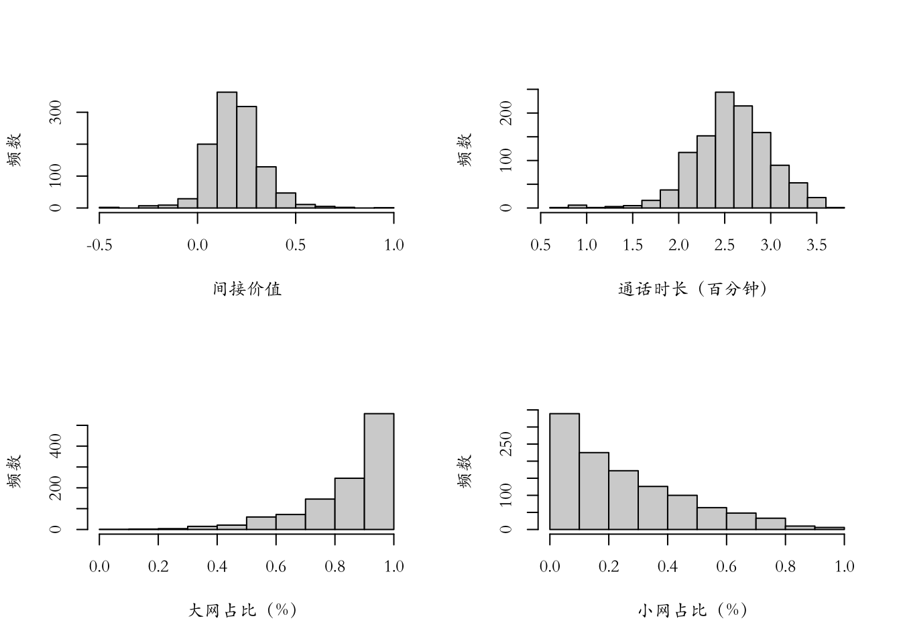
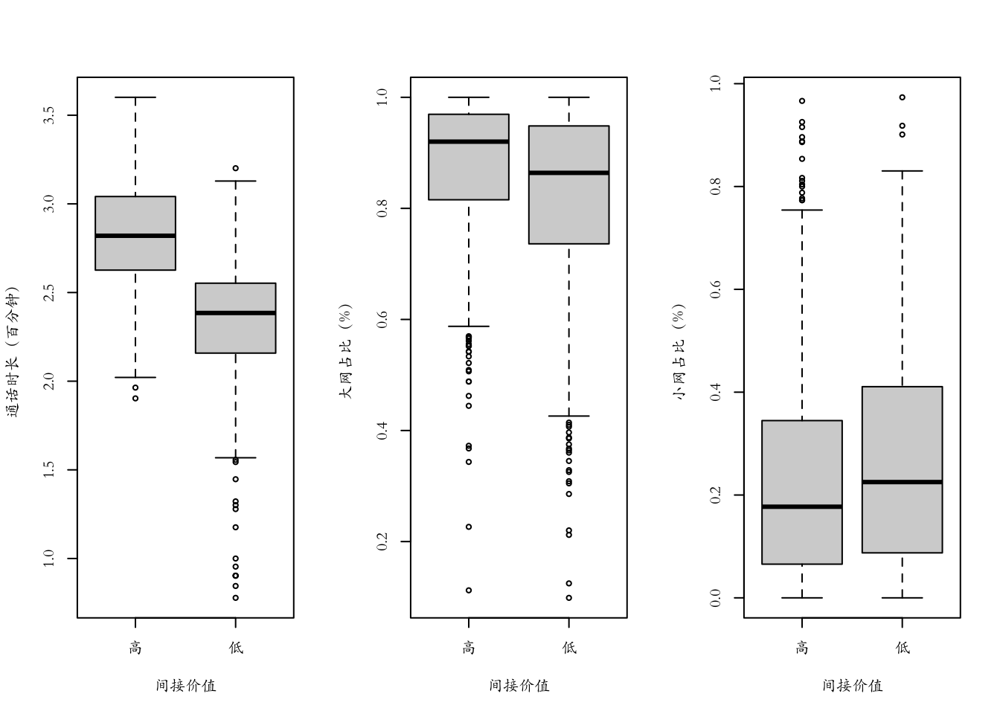
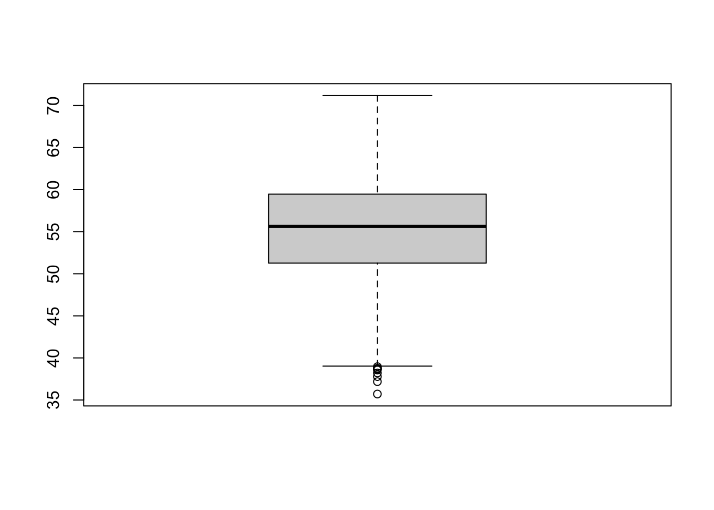
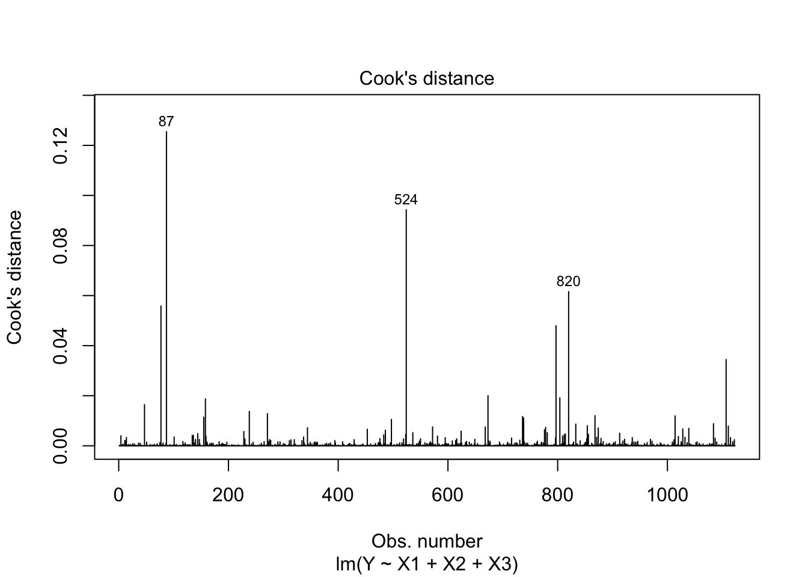
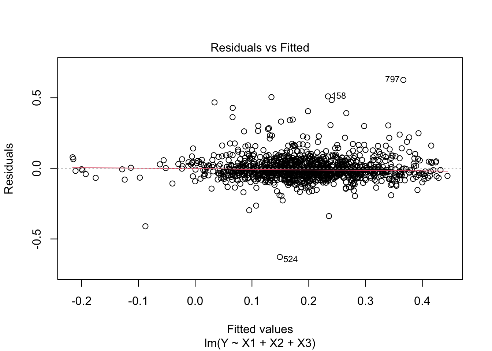
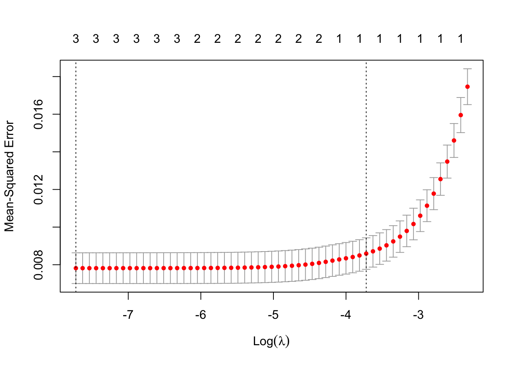
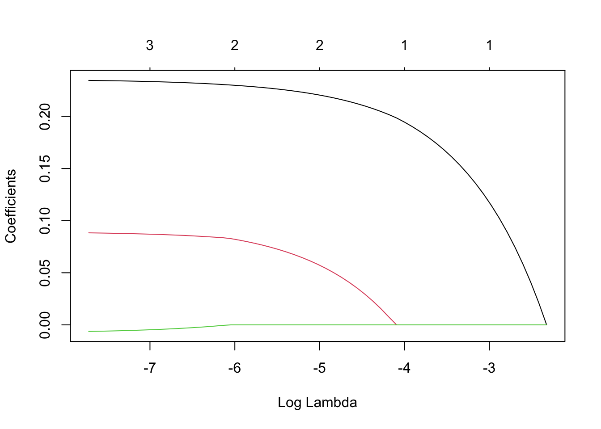

# 线性回归——以移动通信校园网中推荐者的推荐价值分析为例

## 研究目的   

  企业管理者需要在现有的客户资源中，区分并发现对自己最有价值的客户。传统的营销智慧告诉我们：往往是20%的最有价值客户，贡献了企业80%的利润。找到最有价值的客户，对于公司高效运营意义重大。
  
  在实际操作中，这绝非易事。首先须面对的挑战就是:什么是客户价值？如何测量？显然，对于不同的行业、不同的企业、不同的时期，答案各不相同。  

## 背景介绍
    
  运营商的主要业务是向客户提供无线通信服务，并收取相应的费用。三大运营商（移动、联通、电信）互相挖墙脚，增加规模开始变得艰难。很多客户今天用A公司的服务，明天只要B公司给一点点好处，就改用B公司的，再过几天A公司有新的打折促销计划，又换回A公司。如何增强客户忠诚度，提高盈利能力，对公司来说十分重要。为此，移动运营商推出了校园网计划。
    
  校园网计划是一个客户忠诚度的培养计划。该运营商关注的客户群体中很重要的一部分是高校在校生。高校在校生本身是一批非常优质的客户。按照校园网运营规则，如果一名高校在校生希望加入校园网，他首先必须是该运营商的用户。此外，还得由现有校园网用户进行邀请。作为回报，所有的校园网内通话资费都会非常便宜，而且有非常大的数据流量优惠，但与网外朋友通话资费照旧。
    
  所以，为了进一步降低自身的资费水平，现有校园网成员有很大的动力邀请朋友加入校园网。同时，已经加入校园网的成员则发现很难离开，因为大部分朋友及主要的社交网络都在校园网中，个人一旦离开，还想保持跟过去一样的沟通强度，成本昂贵。  
    
  为了深度“套牢”在校生客户，运营商有重要付出，即降低资费。此外，为了迅速扩张，鼓励大家推荐新客户，运营商对推荐者有一定的奖励。例如，成功推荐一名用户，推荐者将获得10元话费+1GB数据流量。
    
  通过一段时间的运营发现:
      
  - (1)好消息是离网率确实下降不少，总利润有所上升；
      
  - (2)坏消息是总利润上升低于预期。
    
  为什么?业务员反馈回来一个重要的信息:由于缺乏可靠的手段识别被邀请的用户是否真的是高校在校生，很多低端客户被加进来，而他们并不是高校在校生。这部分客户的总消费量（如通话总量）并没有因为入网而有所上升；相反，由于资费的下降，他们给公司贡献的收入大幅下降。当然，这是负面案例，并不是全部的情况。也有正面案例，有的客户自己入网后，能够进一步吸引一大批优质客户入网。相比入网前，他们的沟通交流更加密切。因此，尽管单位时长的资费水平下降很多，但是他们对企业的总利润贡献上升不少。  

  因此，需要详细研究：什么样的推荐者能够带来高（或低）价值客户？这样，才能把有限的奖励资源有针对性地投入到那些能够为企业带来高价值客户的推荐者身上。 

## 指标设计

### 因变量

  哪个指标能够刻画推荐者价值，就是因变量。

  首先，推荐者本身也是校园网的普通消费者。因此，毋庸置疑，他对企业的直接利润贡献是其价值的一个重要组成。为方便起见，简称这部分价值为该客户的直接价值。但是，本案例更关注推荐者通过推荐其他客户带来的间接价值。
    
  如何量化一个推荐者的间接价值?假如一名推荐者为企业推荐了三名客户，他为企业带来了多少利润?这依赖于这三名客户在被推荐前后的行为变化。如果在被推荐加入校园网之前，他们每个月总共贡献利润100元，加入校园网后变成了80元，那么这就是一个失败的推荐者，他的推荐行为为企业带来的利润相对变化为:(80-100)/100=20%，如果在加入校园网后 这三名客户的利润贡献是120元，那么推荐者对企业的间接利润贡献为(120-100)/100=20%，因此，本章的因变量就是某推荐者所有推荐客户在加入校园网前后的相对利润变化率。  

### 自变量

  确定了因变量以后，再考虑解释变量，对一个自然人的描述依靠高矮胖瘦等指标，对一个推荐者(消费者)的刻面就得靠具有营销实践意义的消费者特征或者标签，在实际工作中，研究者积累了大量的有用指标(或者标签)，能够比较详细地刻画一个推荐者的方方面面。例如可以考虑消费者的消费行为，主要包括该用户在各项通信及增值业务(如通话、短信、彩铃、上网)上的花费；还可以考虑消费者的通话特征，包括该用户的通话时长、通话频率、通话时间(早上、中午、晚上)；还可以进一步地将通语时长拆分成主叫、被叫、本地、长途、漫游等。总而言之，实际工作中可以考虑的标签很多，它们有助于更好地描述目标客户(推荐者)，而这些标签统统都可以成为解释变量X。就本案例而言，为简单起见，只考虑下面几种标签。  

**通话总量($X_1$)**  
通话总量即总的通话时长，以百分钟计。毫无疑向，这是一个很重要的变量，它直接刻画了用户的活跃程度。在单位时间内(如一个月内)，通话总量高的用户更加活跃。由于校园网提供非常优惠的通话资费，因此对那些通话总量高的用户有很强的吸引力。假设高通话量的用户的好友(被推荐者)也更有可能是高通话量用户(也是“话痨”)，那么具有高通话总量特征的推荐者就更有可能带来优质客户。   

**大网占比($X_2$)**  
所谓大网就是该运营商的无线通信网络。大网占比衡量了在用户的所有通话时长中，有多少发生在该运营商的网内。假设该运营商是联通，那么一个人的通话总量可能发生在联通内部，也可能发生在联通外部(移动、电信)。如果将一个人的通话总量(联通、移动、电信、其他)看作他基于移动通信的社会关系网络的全部，那么所谓大网占比就是该推荐者的移动通信社会关系网络中，有多少被该运营商(如联通)所覆盖。这个占比越高，说明该用户基于移动通信的社交网络越多地发生在该运营商生态体系内。因此，该用户的潜力巨大。

**小网占比($X_3$)**  
所谓小网就是校园网。相对于大网而言，这是一个更小的网络，是大网的子集。小网占比是大网占比的有力补充。大网占比衡量了一个用户全部的移动通信社交网络有多少在该运营商的网络内，小网占比衡量的则是该用户已经发生在大网(即该运营商网络)内的通话时长中，有多少发生在校园网(即一个更小、有更优惠资费的网络)内。请注意，要加入校园网的一个前提条件是：该用户已经是该运营商的用户。因此，一个推荐者能推荐发展多少用户是有上限的，即该用户所有的发生在该运营商网络内部的社交关系。如果一名用户小网占比很高，说明该用户可被推荐的社会关系网络(请注意，大网以外的客户是不能加入小网的)中的绝大部分已经加入了校园网，因此，该用户没有更多的被推荐对象，所以推测他能为企业带来的价值也许不高。

### 数据读入


```r
a = read.csv("第1章.csv",header=T,fileEncoding = "GBK")
names(a) = c("Y", "X1", "X2", "X3")
dim(a)
```

```
## [1] 1123    4
```

```r
head(a)
```

```
##            Y       X1        X2         X3
## 1  0.2126197 2.822822 0.9037594 0.21954887
## 2  0.2756156 2.628389 0.9717647 0.02823529
## 3  0.1687526 2.537819 0.9913043 0.22318841
## 4  0.1544425 3.201124 0.8986784 0.11264947
## 5  0.3337990 3.132580 0.8467207 0.15327929
## 6 -0.2064917 0.845098 1.0000000 0.00000000
```


## 描述性统计分析

对于连续型数据而言，基本的描述统计量(如样本均值、标准差、最大最小值、中位数等)都可以考虑计算一下。

**绘制直方图**


```r
par(family='STKaiti')
par(mfrow = c(2,2))
hist(a$Y, xlab = "间接价值", ylab = "频数",main=NULL)
hist(a$X1, xlab = "通话时长（百分钟）", ylab = "频数",main=NULL)
hist(a$X2, xlab = "大网占比（%）", ylab = "频数",main=NULL)
hist(a$X3, xlab = "小网占比（%）", ylab = "频数",main=NULL)
```



**对各个指标计算描述统计量**


```r
N = sapply(a,length)  #有效样本量   sapply：输 入为列表，返回值为向量
MU = sapply(a,mean)   #样本均值
SD = sapply(a,sd)     #样本标准差
MIN = sapply(a,min)
MED = sapply(a,median)#中位数
MAX = sapply(a,max)
result = cbind(N,MU,SD,MIN,MED,MAX) #cbind:根据列进行合并;rbind:根据行进行合并
result
```

```
##       N        MU        SD         MIN       MED       MAX
## Y  1123 0.1930176 0.1324444 -0.49801016 0.1870535 0.9925818
## X1 1123 2.5804381 0.4083604  0.77815125 2.5831988 3.6009729
## X2 1123 0.8457207 0.1538765  0.09867452 0.8983452 1.0000000
## X3 1123 0.2521307 0.2112832  0.00000000 0.1983730 0.9734904
```

对本例而言，X和Y都是连续型数据。因此，一个自然的想法是，做一个关于X和Y的散点图，希望从中能够看到大概的趋势。但是，经验表明，对于大多数实际问题，数据噪声很大，从散点图上很难看出清晰的规律。因此，推荐一种简单粗糙但更有效地描述统计方法。具体而言，可以根据因变量Y的取值将数据分成不同的组(如高、中、低)。对本例而言，以因变量Y的中位数为阈值，将数据分成两组(高价值组、低价值组)。然后，对每个X变量做箱线图。

**绘制分组箱线图**


```r
#对每个X变量结合Y做进一步地描述统计分析
a$cat = as.factor((a$Y > median(a$Y))*1)   #以Y的中位数为阈值，将数据分为两组
levels(a$cat) = c("低","高")
a$cat = factor(a$cat,levels=c("高","低"))
par(family='STKaiti')
par(mfrow = c(1,3))
boxplot(X1~cat,data=a,xlab="间接价值", ylab="通话时长（百分钟）")
boxplot(X2~cat,data=a,xlab="间接价值", ylab="大网占比（%）")
boxplot(X3~cat,data=a,xlab="间接价值", ylab="小网占比（%）")
```



## 线性回归模型

在描述分析的基础上，进一步分析因变量Y和各个解释变量$(X_1,X_2,X_3)$之间的关系。更进一步地，希望知道解释变量是怎样影响因变量的，其影响强度如何。研究解释变量和因变量之间的关系，需要建立模型。在回归分析的框架下，模型就是一个连接解释变量X和因变量Y之间关系的函数表达式。因此，不妨假设：    
$$模型A：Y=f(X)$$      
式中，$f(^.)$是一个事前设定的函数形式，而$X=(X_1,X_2,X_3)'$是一个三维向量，代表了所有的解释变量。如果要这个模型付诸实施，需要思考什么样的函数形式$f(\cdot)$最适合。

模型A表达的是一种确定性的函数关系。这显然是一个非常不合理的性质。以本案例为例，即使两个推荐者的所有解释变量完全相同(即相同的通话总量$X_1$，相同的大网占比$X_2$，相同的小网占比$X_3$)，他们为企业带来的间接价值Y也不可能完全相同。因为本案例所采集的解释变量X，是影响该推荐者间接价值Y的无穷种因素中的3个而已，除此以外，还有很多其他的影响因素(如性别、收人、性格、情绪等)。即使两个推荐者在现有的3个X变量上取值完全相同，但在其他的未被采集的相关因素上的取值却一定有所不同(否则为什么是两个不同的人呢)。所以，极有可能这两个人的推荐者间接价值Y也是不一样的。那么，有可能通过采集更多的解释变量彻底解决这个问题吗？答案是否定的。因为现实世界中的复杂因素无穷多，而且在不停的动态变化中。所以，一个合理的统计学模型不可能彻底解决所有的不确定性。     
那么不确定性又应该如何刻画?在数学层面，应该如何改造模型A，使得它可以兼容不确定性?一个最简单的办法是引入噪声项ε，也叫随机扰动项。因此，对模型A稍作修改，就变成了：     
$$模型B：Y=f(X,ε)$$       
式中，$f(^.,^.)$也是一个事先设定的函数。        
假设$f(^.,^.)$是最普通的线性函数，这就有了线性回归模型。

具体数学形式如下：     
$$模型C:Y=β_0+β_1X_1+β_2X_2+β_3X_3+ε$$
式中$β=(β_0,β_1,β_2,β_3)'$称作回归系数。为了处理方便，要求噪声项ε的期望$E(ε)=0$。   

## R实现


```r
#建立模型
fit = lm(Y~X1+X2+X3, data = a)
summary(fit)
```

```
## 
## Call:
## lm(formula = Y ~ X1 + X2 + X3, data = a)
## 
## Residuals:
##      Min       1Q   Median       3Q      Max 
## -0.62789 -0.04540 -0.01281  0.03177  0.62598 
## 
## Coefficients:
##              Estimate Std. Error t value Pr(>|t|)    
## (Intercept) -0.488566   0.026160 -18.676  < 2e-16 ***
## X1           0.235569   0.006519  36.135  < 2e-16 ***
## X2           0.089486   0.022915   3.905 9.98e-05 ***
## X3          -0.007807   0.016586  -0.471    0.638    
## ---
## Signif. codes:  0 '***' 0.001 '**' 0.01 '*' 0.05 '.' 0.1 ' ' 1
## 
## Residual standard error: 0.08826 on 1119 degrees of freedom
## Multiple R-squared:  0.5571,	Adjusted R-squared:  0.5559 
## F-statistic: 469.1 on 3 and 1119 DF,  p-value: < 2.2e-16
```

## 模型理解  

首先考虑模型C中的随机干扰项$ε$。$ε$代表的是那些没有被解释变量X捕捉的，但是对因变量Y有影响的，说不清道不明的其他因素，因此，ε是完全不可控的因素，没有太大的关注必要，也没有精确把控的可能性。那么关注的重点应该就是这三个X变量和它们对应的同归系数，弄清这三个X变量和Y的相关关系到底怎样。对于每一个具位的X变量，有三个核心问题：  

  - (1) 该变量同Y有相关关系吗?尤其是在控制(或者剔除)其他两个X变量的影响后。以本案例$X_1$为例，在控制大网占比$X_2$和小网占比$X_3$不变的前提下，通话总量X的变化是否同推荐间接价值Y相关?  

  - (2) 如果相关，该X变量同Y的相关关系是正的还是负的?以本案例$X_1$为例，假设通话总量$X_1$同Y确实相关，那么它们的相关性是正还是负?   

  - (3) 假设某X变量同Y确实相关，而且相关关系为正，该相关关系的强度到底如何?以本案例X$X_1$为例，在控制大网占比$X_2$和小网占比$X_3$不变的前提下，通话总量$X_1$的单位变化能产生多少关于推荐者间接价值的预期变化?  

这三个问题的答案统统都隐藏在三个所对应的$β$系数中。  

接下来，做一些更加具体的数学讨论。$β=(β_0,β_1,β_2,β_3)'$是线性回归模型C的回归系数向量，其中包含了两种不同的系数。一种是截距项$β_0$，另外一种是普通的系数项$β_1$，$β_2$和$β_3$。它们的意义是不一样的。

### $β_0$的理解

针对本例，$X = 0$代表这样一类推荐者，他们的通话总量为0($X_1=0$，每月只打0分钟电话)，大网占比为0 ($X_2=0$，通话总量都为0了，其实大网占比无法定义)，小网占比也为0($X_3=0$通话总量都为0了，其实小网占比也无法定义)。显然，这样的推荐者是不可能存在的。因此，对本案例而言，$β_0$没有什么好的可解读性。

对于这种情况有两个办法。

  - 第一个办法，忽略它。
    
  - 第二个办法，可以考虑在建立回归模型之前，先将所有的解释变量中心化，即重新定义:$X=X-E(X)$，这样做的直接后果就是$E(X)=0$，再结合模C型，不难验证$E(Y)=β_0$。因此，在这种情况下，截距项反映的是因变量的简单样本均值。 
  
### $β_1$的理解  
  
$β_1$反映的是在其他解释变量(即大网占比$X_2$和小网占比$X_3$)保持不变的情况下，通话总$X_1$的单位变化能带来的对因变量Y的变化预期。      

### $σ_y^2$的理解

在假设ε与X相互独立的前提下，      
$$σ_y^2=var(β_1X_1+β_2X_2+β_3X_3)+σ^2$$
这说明，因变量Y的变异性$σ_y^2$是由两种不同的原因造成的。第一种是解释变量，即$var(β_1X_1+β_2X_2+β_3X_3)$。这部分变异性是解释变量X造成的，因此可以通过解释变量X所解释。第二种是噪声项ε造成的，即$σ^2$。按照上式，噪声项的变异性是不可能超过因变量的变异性的。因此，可以考虑通过比较$σ_y^2$和$σ^2$的相对大小来判断随机噪声项在模型C中所起的作用。

## 估计方法    

假设有n个样本，i代表其中一个特定的个体，因此有1≤i≤n。用$(Y_i，X_i)$代表来自第i个样本的数据，其中$Y_i$是因变量，而$X_i =(X_{i1},…,X_{ip})'$是相应的解释变量。对本案例而言，$p=3$。一般的线性回归模型允许任意多的解释变量，只要其个数p比样本量n小很多。模型C可以重新表述如下:    
$$Y_i=β_0+β_1X_{i1}+…+β_pX_{ip}+ε_i$$
式中，$ε_i$是同第i个个体相关的随机扰动。      
接下来考虑如何估计$β=(β_0,β_1,…,β_p)'$。随机噪声看不见摸不着，不可能把握。所 以，不可能对它有所估计或者预测，先把它忽略掉。这样得到下面的近似模型：$$Y_i≈β_0+β_1X_i1+…+β_pX_ip$$
好的β估计应该极小化$Y_i$和$β_0+β_1X_{i1}+…+β_pX_{ip}$之间的某种距离。可以考虑常用的平方距离：
$$(Y_i-β_0-β_1X_i1-…-β_pX_ip)^2$$    
平方距离应该对每个样本都计算，因此**最小二乘目标函数**为：$$Q(β)=\sum_{i=1}^n(Y_i-β_0-β_1X_i1-…-β_pX_ip)^2$$那么，$\hat{β}=argmin_βQ(β)$。     
最小二乘估计不是唯一估计，那么，**最小一乘目标函数**为：$$Q_1(β)=\sum_{i=1}^n\lvert Y_i-β_0-β_1X_i1-…-β_pX_ip\lvert$$    
通过极小化这个目标函数，可以获得最小一乘估计，但是由于最小一乘估计的目标函数不是一个光滑可导函数，因此不可能有显式解。     
对于某些应用人们有强烈的先验知识。因此，对每个个体的重要性有一个事先的权重判断，记为$ω_i$。将最小二乘目标函数修改：$$Q_2(β)=\sum_{i=1}^nω_i(Y_i-β_0-β_1X_i1-…-β_pX_ip)^2$$    

## 假设检验    

### 全局检验

第一个假设问题是：是否至少有一个解释变量有用？对应于下面的全局显著性假设检验问题：   
$$H_0:\tilde{β}=0, H_1:\tilde{β}≠0$$
其中，$\tilde{β}=(β_1,…,β_p)'$。β是一个(p+1)维向量，包括截距项，而$\tilde{β}$是一个P维向量，不包含截距项。

怎样做全局检验？可以通过考察$RSS_0-RSS_1$的大小得到有用的判断。为此，构造了F-统计量：   
$$F=\frac{(RSS_0-RSS_1)/p}{RSS_1/(n-p-1)}$$    
在原假设成立的情况下，该F-统计量服从一个自由度为(p，n-p-1)的F-分布。以此为依据，可以计算出相应的P-值。  

如果F-检验无法拒绝原假设，说明在现有的数据基础上，找不到足够证据证明所有解释变量至少有一个是重要的。因此分析到此为止。但是，如果F-检验成功推翻$H_0$，那就要追问：哪些解释变量重要？

### 单变量显著性

需要逐个对解释变量$X_j$作下面的局部检验：    
$$H_0:β_j=0,  H_0:β_j≠0$$   
为此，可以考虑标准的t-统计量：    
$$t=\frac{\hat{β_j}}{\hat{SE}(\hat{β_j})}$$     
式中，$\hat{SE}(\hat{β_j})$代表最小二乘估计$\hat{β_j}$的标准差。在原假设成立的情况下，该t-统计量近似服从一个标准的正态分布。但是需要一个前提假设：即残差ε必须严格服从正态分布。 

## 判决系数    

$RSS_0$是在没有任何解释变量帮助的情况下产生的残差平方和，$RSS_1$代表因变量中无法被X变量解释的部分。因此，$RSS_1/RSS_0$刻画了在因变量Y的变异性中，随机噪声项所占的比例。剩余的$(1-RSS_1/RSS_0)$则是由解释变量产生。因此，定义判别系数如下：$$R^2=(1-\frac{RSS_1}{RSS_0})×100\%$$     
判决系数的大小直接反映了解释变量X对因变量Y的拟合情况，也就是拟合优度。   

虽然判决系数这么有用，但它有一个致命的缺陷，即它永远偏爱更加更加复杂的模型。这是由判决系数的数值计算性质决定的。任给一个模型，永远可以通过增加解释变量的个数获得判决系数的进一步提高。但是，假设人为地生成一些与实际问题毫不相关的干扰X数据只可能降低模型的预测精度，但是它们仍会使判决系数微小上升。因此，需要调整判决系数。如下：    
$$R^2_{adj}=(1-\frac{n-1}{n-p-1}×\frac{RSS_1}{RSS_0})×100\%=(1-\frac{RSS_1}{n-p-1}×\frac{n-1}{RSS_0})×100\%$$     

除了调整后的判决系数$R^2_{adj}$，还有一个解决方案，就是外样本判决系数$R^2_{out}$。就是要根据一定的比例(如1:1)，将数据一分为二。第一部分数据用于训练模型估计参数。这部分数据称作训练数据，训练数据的任务是产生最小二乘估计$\hat{β}$。第二部分数据用于验证$\hat{β}$的预测精度，称为验证数据，用$S_0=\{(Y_i,X_i):1≦i≦n\}$表示训练数据集，$S_1=\{(Y_i^*,X_i^*):1≦i≦n\}$表示验证数据集。如果当初切分数据的时候采用的比例是1:1，那么两个数据集合的样本量应该是一样的，即n=m。然后，外样本判决系数的定义如下:    
$$R^2_{out}=[1-\frac{\sum_{i=1}^m(Y_i^*-\hat{β_0}-\hat{β_1}X_{i1}^*-\hat{β_2}X_{i2}^*…-\hat{β_p}X_{ip}^*)^2}{\sum_{i=1}^m(Y_i^*-\bar Y^*)^2}]×100\%$$      

### R实现：基于外样本判决系数的拟合优度


```r
nsimu = 1000					
ss = length(a[,1])
ss0 = round(ss*0.8)
R2 = rep(0,nsimu)
for(i in 1:nsimu){
  a = a[order(runif(ss)),]
  a0 = a[c(1:ss0),]
  a1 = a[-c(1:ss0),]
  fit0 = lm(Y~X1+X2+X3, data=a0)
  Y.hat = predict(fit0, a1)
  Y.true = a1$Y
  sse = sum((Y.hat-Y.true)^2)
  sst = sum((Y.true-mean(Y.true))^2)
  R2[i] = (1-sse/sst)*100
}
par(mfrow = c(1,1))
boxplot(R2)
```




但是$R^2_{out}$也有缺点。第一，要采纳外样本判决系数方法，数据样本量不能太小，否则无法支持数据切分。第二，结果有可能不稳定，因为数据的切分是随机的，所产生的结果也是随机的。如果数据样本量足够大，该随机性有可能很小可忽略。但是，如果数据样本量不够大，那么该不稳定性就明显。一个可能的解决方法就是重复多次试验，最后获得一个稳定的综合判断。

## 多重共线性   

只要有一个解释变量能够被其他几个很好的线性表出，线性模型就会受到多重共线性的影响。怎么度量一个解释变量受多重共线性影响的严重程度呢？可以拟合下面的线性模型：   
$$X_j=β_0+\sum_{k≠j}β_kX_k+ε$$      
简单来说，就是用第j个解释变量$X_j$作为因变量，而其它的解释变量作自变量重新拟合一个线性回归模型。产生的判决系数记做$R_j^2$。为分析方便，定义如下方差膨胀因子，即    
$$VIF_j=\frac{1}{1-R_j^2}$$     
从理论上讲，VIF越大，相应的解释变量所承受的多重共线性影响越大。对于实际问题，很多学者遵循一个原则，就是不要大于10。

### VIF计算


```r
library(car)
```

```
## Loading required package: carData
```

```r
vif(fit)
```

```
##       X1       X2       X3 
## 1.020728 1.790661 1.768610
```

## Cook距离

方差膨胀因子能够判断一个解释变量是否受多重共线性影响。从另一个角度看，这在帮助判断是否一个解释变量的存在会极大地伤害整个回归结果的有效性。同理，可以对每一个样本问类似的问题：现有的样本中，是否存在这样的“少数揣蛋鬼”？它们的存在极大地影响了回归分析的结果。在统计学理论中，这样的“捣蛋鬼”称为影响点。怎样判断一个样本是不是影响点呢？   

著名的统计学家库克想出了一个非常巧妙的办法。他说可以为每一个样本打分，给影响力特别大的样本打高分，给影响力不大的样本打低分，然后就可以根据分值高低判断谁是“捣蛋鬼”。该打分后来被人们称作Cook距离。具体如何打分呢？库克说那就看该样本影响力的大小。但是影响力又是什么?应该如何测量?库克认为如果一个样本有没有它所产生的回归分析结果基本一样，那么该样本就没有什么影响力；相反，如果一个样本的存在与否极大地影响着相应的回归分析结果，那么它的影响力就很大。数学上怎么测量？$\hat{β}$是基于所有样本所获得的最小二乘估计，对于一个给定的样本i，如果要判断它的影响力，将该样本剔除之后，重新计算最小二乘估计，记为$\hat{β}_{(-i)}$。对比$\hat{β}$与$\hat{β}_{(-i)}$之间的差异。定义Cook距离如下：    
$$D_j=\frac{(\hat{β}-\hat{β}_{(-i)})'(X'X)(\hat{β}-\hat{β}_{(-i)})}{(p+1)\hat{σ}^2}$$   
式中，$X=(X_1,X_2,…,X_n)'$是设计矩阵。如果发现，少数一两个样本的Cook距离特别大，应该考虑将此类样本剔除后，重新拟合回归分析。

### R实现


```r
plot(fit,which = 4) #Cook距离
```




```r
plot(fit,which = 1) #残差图
```




## 模型选择  

**AIC准则**    
理论思想是假设在考虑的所有线性模型中，没有任何一个模型是“真模型”。模型选择的目标不是挑选那个唯一正确的“真模型”，而是挑对“真模型”逼近最好的线性模型。为此，它采用了Kullack-Leibler距离去测量各个线性模型同那个所谓的“真模型”之间的差异，并尝试寻找差异最小的那一个。该差异可以用下面这个统计量估计:    
$$AIC=n\{log(\frac{RSS}{n})+1+log(2π)\}+2(p+1)$$   
式中，RSS是残差平方和；(p+1)是选入模型的变量个数(这里包含截距项)；n为样本量。当选入模型的变量增加时，模型变得越来越复杂，p变得越来越大，因此拟合残差平方和RSS是减少的，但是惩罚项2(p+1)是增加的。如果由解释变量增加带来的方差减少很大时，AIC的值就会减小，这说明新增的变量很重要。否则，AIC的值将会增加，这说明新增的变量不重要。因此，使用AIC选择变量的原则是:使AIC达到最小的模型是“最优”模型。因为该模型有可能最好地逼近那个所谓的“真模型”，预测精度有可能最优。 

**BIC准则**    
BIC假设在考虑的所有线性模型中确实存在一个所谓的“真模型”，而真实数据就是根据这个线性模型生成的。该模型中涉及的X指标都是重要的，即相应的β系数不为0，而其他不重要的X指标已经被剔除在外了。假设有p个X指标，每个指标都有可能被“真模型”采纳或不采纳两种可能，这就产生了$2^p$个待选模型。施瓦茨采用了贝叶斯学派的思想，给每一个模型赋予一个先验概率。然后，基于观测到的X和Y数据，再反推各个待选模型的后验概率。他惊奇地发现，只要样本量足够大，这个后验概率的大小跟先验概率关系不大，而主要由下面这个统计量决定：    
$$BIC=n\{log(\frac{RSS}{n})+1+log(2π)\}+log(n)(p+1)$$     
BIC越小，对应模型是“真模型”的后验概率就越高。与AIC准则函数相比，当n≧8时log(n)>2，此时BIC的惩罚力度比AIC大。因此BIC选出来的变量个数往往少于AIC选出的个数。 

AIC认为“真模型”不可能是线性的。AIC这个性质称为损失有效性。BIC不具备该优良性质，BIC是假设“真模型”就是一个被我们考虑的线性模型。这个性质叫做“选择相合性”。    

### R实现


```r
#模型选择
model.aic = step(fit, trace=F)
model.bic = step(fit, k=log(ss), trace=F)
summary(model.bic)
```

```
## 
## Call:
## lm(formula = Y ~ X1 + X2, data = a)
## 
## Residuals:
##      Min       1Q   Median       3Q      Max 
## -0.63101 -0.04534 -0.01273  0.03086  0.62575 
## 
## Coefficients:
##              Estimate Std. Error t value Pr(>|t|)    
## (Intercept) -0.495837   0.021105 -23.493  < 2e-16 ***
## X1           0.235294   0.006491  36.252  < 2e-16 ***
## X2           0.096597   0.017225   5.608 2.58e-08 ***
## ---
## Signif. codes:  0 '***' 0.001 '**' 0.01 '*' 0.05 '.' 0.1 ' ' 1
## 
## Residual standard error: 0.08823 on 1120 degrees of freedom
## Multiple R-squared:  0.557,	Adjusted R-squared:  0.5562 
## F-statistic: 704.1 on 2 and 1120 DF,  p-value: < 2.2e-16
```


## LASSO

完成变量选择与参数估计。


```r
library(glmnet)
```

```
## Loading required package: Matrix
```

```
## Loaded glmnet 4.1-3
```

```r
attach(a)
cv.outlas<-cv.glmnet(cbind(X1,X2,X3),Y,alpha=1)
plot(cv.outlas) ##cross-validation curve
```



```r
(bestlam<-cv.outlas$lambda.min)
```

```
## [1] 0.0004430234
```

```r
predict(cv.outlas,type='coefficients',s=bestlam)
```

```
## 4 x 1 sparse Matrix of class "dgCMatrix"
##                     s1
## (Intercept) -0.4852724
## X1           0.2345366
## X2           0.0882904
## X3          -0.0062911
```

```r
plot(cv.outlas$glmnet.fit,xvar="lambda") #coefficient plot
```



```r
fit.lasso <- glmnet(cbind(X1,X2,X3),Y,alpha=1,lambda = bestlam)
```


