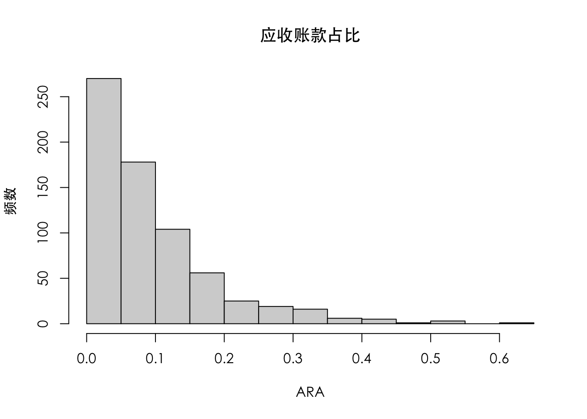
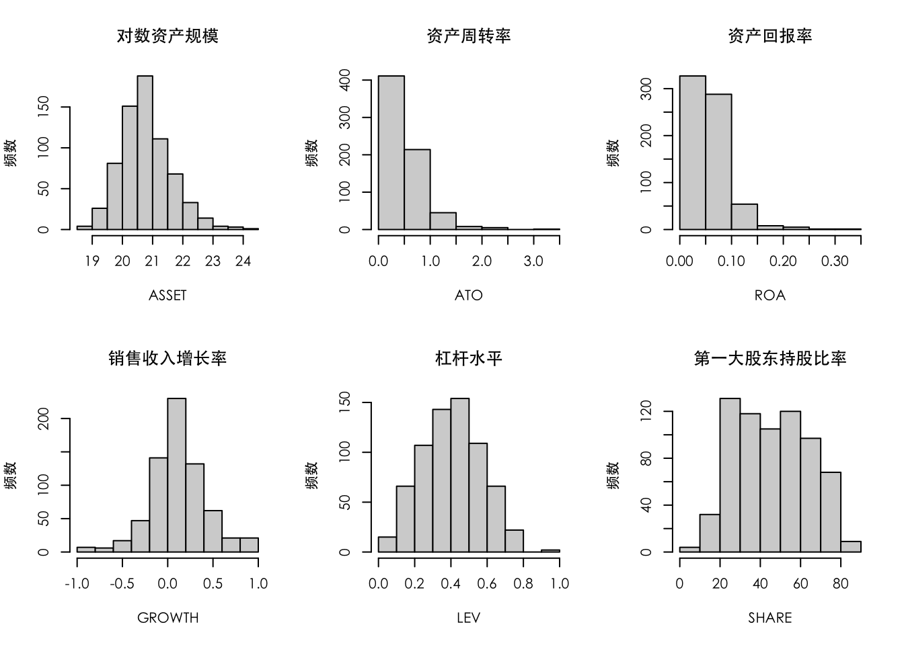
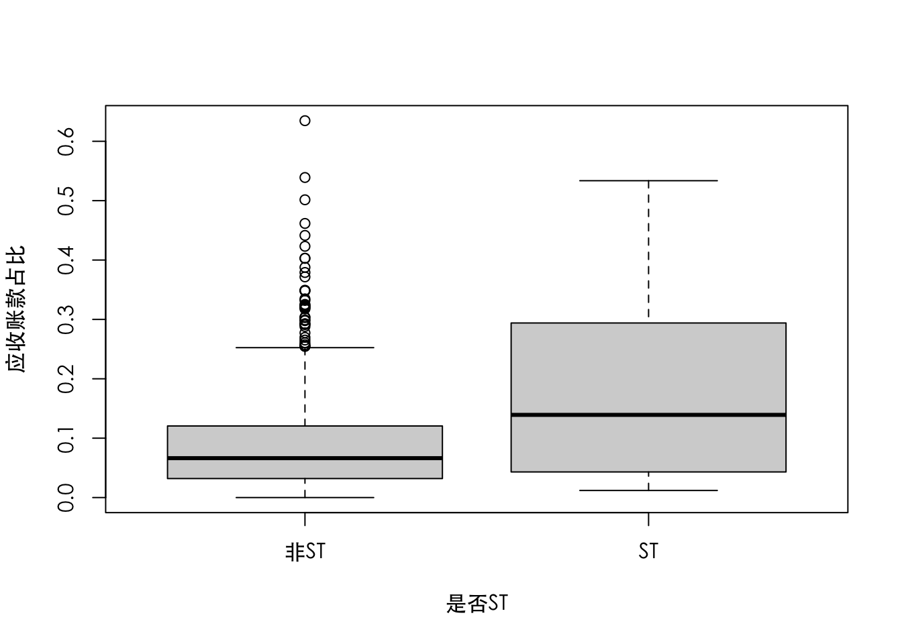
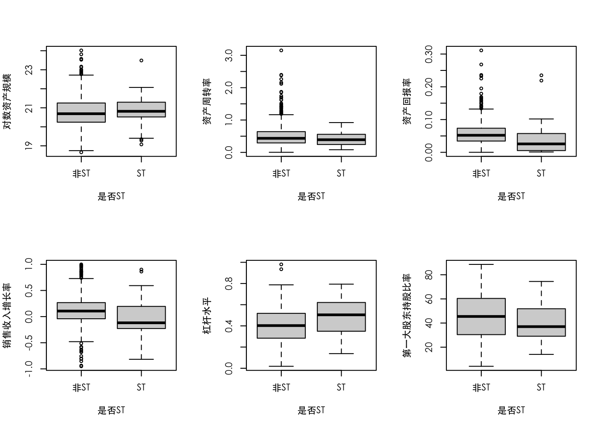
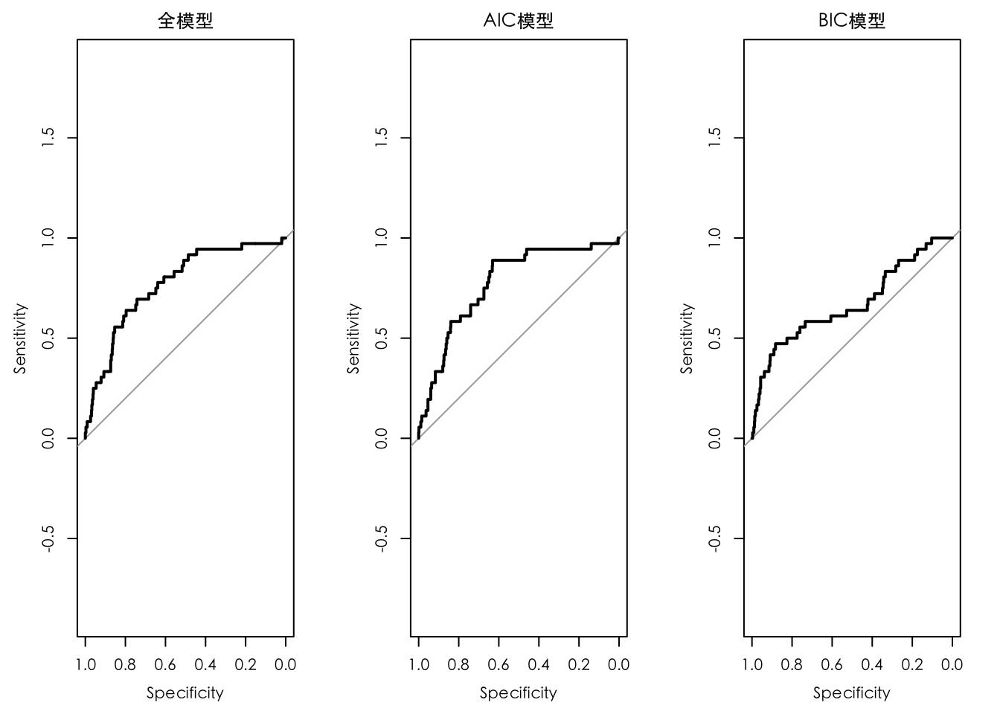
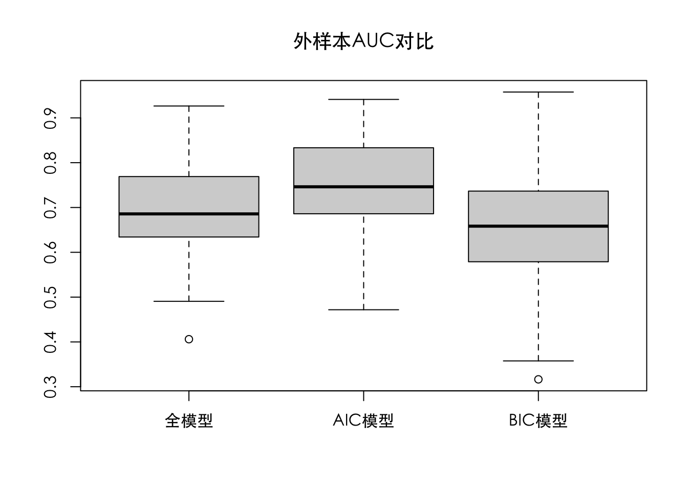

# 逻辑回归——以上市企业特别处理ST为例

## 0-1型因变量Y 

0-1型Y在营销实践中无处不在。例如，消费者面对一个产品，买还是不买，这就是一个0-1型数据。营销学者尝试去理解这个行为有哪些X可以解释。广告这个X可以解释吗?促销这个X可以解释吗?价格这个X可以解释吗?还是渠道这个X?或者其他?当一个消费者在互联网上漫无目的地搜索，突然跳出来一个广告，请问他点还是不点?这又是一个重要的0-1型因变量。假设，你是一个电商应用的产品经理，你关心个性化推荐算法。你需要理解，对一个什么样的人(人口统计学X)，如何根据他的购买习惯(购买记录相关的X)，选择合适的场景(时间地点相关的X)，推荐最合适的产品(产品品类相关的X)，会产生什么样的购买行为(购买与否，0-1型Y)。   

0-1型Y在运营中无处不在，以移动通信运营商为例，过去的运营商工作主要以发卡为主。但是，现在手机已经非常普及，很多人甚至有多个手机号码，指望通过增加发卡量来刺激业务增长已经不再现实。因此，各大运营商开始重视客户关系管理，一方面稳住现有客户，一方面去竞争对手那里挖墙脚。从稳住自己高价值客户的角度看，运营商关心：什么样的客户(客户历史消费相关的X)面对什么样的诱惑(竞争对手营销措施相关的X)，在什么样的挽留手段下(挽留手段相关的X)，会有怎样的去留决定(是否流失，0-1型Y)。同时，运营商还关心，竞争对手那边什么样的客户(客户特征相关的X)，通过什么样的营销手段(广告相关的X)，传递什么样的产品信息(产品相关的X)，能把他拉过来(是否转化为我们的客户，0-1型Y)。 

0-1型Y在投资中无处不在，最简单的例子是买卖股票。如果你能准确预测某只股票明日股价的涨跌(涨=1，跌,=0，0-1型因变量Y)，你就会获得可观的超额收益。稍微复杂一点，假设你做天使投资，你投资的都是非常早期的项目，风险巨大，请问哪一个项目才有可能获得一个阶段性成果(例如A轮融资)?这又是一个重要的0-1型Y。很多人说，这要看人，创始人很重要。因此，你会考虑一堆跟创始人相关的X。他的年龄、教育程度、工作经历、创业经历等都是相关的X变量。有人还说，这要看行业。如果这是对的，你需要一堆关于行业的X。例如，相关的产业政策，行业的增长率，行业的利润情况，行业的竞争态势等，这都是非常重要的X，还有人说，这要看整个核心团队的技术实力，因为毕竟只有技术才是真正的壁垒。因此，你需要很多关于该团队技术实力的X指标。例如，博士数目、专利数目、相关认证等。如果一个投资商能建立这些X和Y(如是否获得A轮融资)之间的强相关关系，那么他的天使投资行为将承担更小的风险，拥有更大的胜算。

0-1型Y在信贷业务中无处不在。假设你是一个银行的主管，负责信贷业务。面对陌生申请人的时候，应该如何决策?你面临的问题就是:如果把钱借给这位陌生人，他能连本带息准时偿还吗?他违约的可能性有多大?为此，需要一个回归分析模型去理解，对什么样的申请人(申请人相关的X，如职业，教育水平，收入水平，历史信用记录等)，发放什么样的贷款产品(信贷产品相关的X，如授信额度、期限、还款形式等)，他是否会准时偿还(还是不还?0-1型Y)。  
综上所述，0-1型因变量丫在实际生活和工作中几乎无处不在。因为人生就是由一系列决策构成的。从个人生活到企业决策，再到家战略，都面临一系列的决策问题。而决策就是一个0-1型的选择问题。如果想研究、理解并优化我们的选择和决策，就需要构建以0-1型丫为目标的回归分析模型。  

## 案例介绍  

**特别处理(special treatment,ST)政策**      
ST政策是我国股市特有的一项旨在保护投资者利益的政策。具体地说，当上市公司出现财务状况或其他状况异常，导致投资者难以判断公司前景，投资者利益可能受到损害时，交易所要对该公司股票交易实行ST。被ST的股票每日涨跌幅度是受到限制的。正常情况下，证监会规定一只股票的每日最高涨跌幅为10%，而被ST的股票其日涨跌幅被限制以在5%内，这样政策性的限制约束了该股票的日内波动幅度。如果把一只股票收益率的波动幅度看作其风险的一个重要表达，限制股票的每日涨跌幅度似乎可以在一定程度上控制风险。除了涨跌幅度限制，对被ST的股票，证监会要求在原股票名称之前加上提醒性注释“ST”，同时，该上市公司的中期报告必须审计。如果一个ST企业仍然持续亏损，那么它将有被退市的风险。不过对一只被ST的股票而言，虽然其每日涨跌幅度不能超过5%，但是它可以通过连续的涨停板或者跌停板使得周度收益率变化幅度仍然极大。因此，限制日度收益率的波动幅度能否减小周度(甚至月度)收益率是一个有争议的话题。

什么样的企业会被ST呢?在上海证券交易所公布的《上海证券交易所股票上市规则(2008年修订)》第十三章特别处理中有详细规定。具体摘录如下：  
    
    13.2.1 上市公司出现以下情形之一的，本所对其股票交易实行退市风险警示：     
    (一)最近两年连续亏损(以最近两年年度报告披露的当年经审计净利润为依据）；  
    (二)因财务会计报告存在重大会计差错或者虚假记载，公司主动改正或者被中国证监会责令改正后，对以前年度财务会计报告进行追溯调整，导致最近两年连续亏损；  
    (三)因财务会计报告存在重大会计差错或者虚假记载，被中国证监会责令改正但未在规定期限内改正，且公司股票已停牌两个月；  
    (四)未在法定期限内披露年度报告或者中期报告，且公司股票已停牌两个月； 
    (五)公司可能被解散； 
    (六)法院受理关于公司破产的案件，公司可能被依法宣告破产；  
    (七)本所认定的其他情形。  

## 数据介绍  

大股东占款如何影响上市企业的ST风险？本案例构造了一个衡量大股东占款程度的指标。该指标越大，越有理由怀疑大股东占款行为。本章关心的问题是利用第t-3年的财务指标预测第t年的ST状况，因此，因变量是该企业的ST状态，一共有两种可能的状态：ST以及非ST。因此，数学上可以用0-1变量表示。例如，可以定义Y=0表示非ST，Y=1表示ST。0-1变量的所有随机特征都由概率P(Y=1)=p决定。也可以说是由P(Y=0)=1-p决定。因为不同企业的财务状况不同，所有不同样本的概率p也不同，它是一个企业财务状况的函数，如果该企业的财务状况已经被某解释变量X充分表达，那么p应该是X的一个函数，记作p(X)，选择什么样的数学函数去描述p(X)，采用什么样的方法去估计其中的未知参数，是重要内容。  
  
### 指标设计  

哪些公开的财务指和公司是否ST相关?   

**1.ARA($X_1$)**    
该指标是应收账款与总资产的比例，它反映的是盈利质量。应收账款的特点：第一，没有流动性；第二，高风险。从企业运营的角度看，应收账款应该越少越好。  

**2.ASSET($X_2$)**   
该指标是对数变换后的资产，用于反映公司规模。

**3.ATO($X_3$)**
该指标是资产周转率，它是衡量企业资产管理效率的重要财务比率。根据定义，它是一个企业在一定时期内(如一年以内)的销售收入净额除以资产平均总额而得。资产周转率在财务分析指标体系中具有重要地位。通过该指标的对比分析，能在一定程度上了解企业总资产的运营效率。一般情况下，这个数值越高，表明企业总资产周转速度越快。销售能力越强，资产利用效率越高，经营状况越好，被ST的风险应该越低。   

**4.ROA($X_4$)**  
该指标是资产回报率，按照定义，它是一个企业在一定时期内(如一年以内)的利润总额除以总资产，它反映的是每单位资产能够给企业带来的利润。该指标可以看作对企业盈利能力的反映。  

**5.GROWTH($X_3$)**  
该指标是销售收入增长率。按照定义，它是一个企业在一定时期内(如一年以内)的销售总额除以前一个时期的销售总额而得，它反映的是企业的增长速度。  

**6.LEV($X_6$)**  
该指标是债务资产比率，也叫作杠杆水平。按照定义，它是一个企业债务在其总资产中所占的比率，反映的是企业的总资产中来自债权人的比率。  

**7.SHARE($X_7$)**  
该指标是企业第一大股东持股比率，反映的是该企业的股权结构。如果企业的第一大股东持股比例很高(如大于50%)，说明该企业一股独大，其持有者对企业的方方面面具有绝对的话语权；如果企业的第一大股东持股比例很低(如小于10%)，说明该企业股权非常分散，没有人为企业的长期利益负责。  

## 描述分析 

数据样本量为684，其中有36个样本为ST样本(即ST=1)，其他是正常样本(即ST=0)，ST样本占总样本的比率为5.26%。本案例涉及7个解释变量，都是连续型的X变量，它们分别为：应收账款占比(ARA)、对数资产规模(ASSET)、资产周转率(ATO)、资产回报率(ROA)、销售收入增长率(GROWTH)、杠杆水平(LEV)和第一大股东持股比率(SHARE)。因此需要对每一个X变量做一个直方图，以检查数据是否存在异常。   
接下来，将Y变量是否ST引入描述统计。是否ST是一个0-1变量，它将整个数据天然地分为两类(ST=0一类，ST=1另一类)。然后对每一个X变量(连续型数据)用箱线图做对比分析。  、
最后对所有变量(X和Y)做一个描述统计分析报表。  

### R实现


```r
a=read.csv("第3章.csv",header=T)
head(a)
```

```
##          ARA    ASSET    ATO         ROA     GROWTH       LEV SHARE ST
## 1 0.19230963 19.85605 0.0052 0.087709802 -0.9507273 0.4458801 26.89  0
## 2 0.22011996 20.91086 0.0056 0.016820383 -0.9426563 0.3986864 39.62  0
## 3 0.32529169 19.35262 0.0166 0.042468332 -0.9374404 0.3033481 26.46  0
## 4 0.02572868 21.43893 0.0028 0.018151630 -0.8529953 0.7582502 60.16  0
## 5 0.53359089 21.61334 0.2552 0.004146607 -0.8167039 0.7268753 54.24  1
## 6 0.06127521 21.04117 0.1248 0.051080619 -0.8102884 0.4017503 57.14  0
```


```r
c(dim(a),sum(a$ST),mean(a$ST))#行数(样本量)、列数(字段个数)、ST样本总数、占比
```

```
## [1] 684.00000000   8.00000000  36.00000000   0.05263158
```


```r
par(family="STHeiti")
hist(a$ARA,main="应收账款占比",xlab="ARA" ,ylab = "频数")#对X变量应收账款占比(ARA)做直方图
```




```r
par(family="STHeiti")
par(mfrow=c(2,3))
hist(a$ASSET,main="对数资产规模",xlab="ASSET",ylab = "频数")
hist(a$ATO,main="资产周转率",xlab="ATO",ylab = "频数")
hist(a$ROA,main="资产回报率",xlab="ROA",ylab = "频数")
hist(a$GROWTH,main="销售收入增长率",xlab="GROWTH",ylab = "频数")
hist(a$LEV,main="杠杆水平",xlab="LEV",ylab = "频数")
hist(a$SHARE,main="第一大股东持股比率",xlab="SHARE",ylab = "频数")
```




```r
par(family="STHeiti")
par(mfrow=c(1,1))#par()一页多图
boxplot(ARA~ST,ylab="应收账款占比",xlab="是否ST",data=a,names=c("非ST","ST"))#箱线图对ARA做对比分析
```




```r
par(family="STHeiti")
par(mfrow=c(2,3))
boxplot(ASSET~ST,ylab="对数资产规模",xlab="是否ST",data=a,names=c("非ST","ST"))
boxplot(ATO~ST,ylab="资产周转率",xlab="是否ST",data=a,names=c("非ST","ST"))
boxplot(ROA~ST,ylab="资产回报率",xlab="是否ST",data=a,names=c("非ST","ST"))
boxplot(GROWTH~ST,ylab="销售收入增长率",xlab="是否ST",data=a,names=c("非ST","ST"))
boxplot(LEV~ST,ylab="杠杆水平",xlab="是否ST",data=a,names=c("非ST","ST"))
boxplot(SHARE~ST,ylab="第一大股东持股比率",xlab="是否ST",data=a,names=c("非ST","ST"))
```




```r
N=sapply(a,length) #有效样本量
MU=sapply(a,mean)  #样本均值
SD=sapply(a,sd)    #样本标准差
MIN=sapply(a,min)
MED=sapply(a,median)#中位数
MAX=sapply(a,max)
result=cbind(N,MU,SD,MIN,MED,MAX) #cbind:根据列进行合并;rbind:根据行进行合并
result
```

```
##          N          MU          SD         MIN         MED        MAX
## ARA    684  0.09504945  0.09228931  0.00000000  0.06832718  0.6346842
## ASSET  684 20.77785347  0.83352322 18.66070036 20.70050279 24.0176107
## ATO    684  0.51977383  0.36282648  0.00280000  0.43340000  3.1513000
## ROA    684  0.05587011  0.03859391  0.00008170  0.05125798  0.3111300
## GROWTH 684  0.11525745  0.30702005 -0.95072732  0.10228264  0.9985565
## LEV    684  0.40606356  0.16576397  0.01843107  0.40673974  0.9803218
## SHARE  684 46.03451754 17.68437717  4.16000000 44.95500000 88.5800000
## ST     684  0.05263158  0.22346029  0.00000000  0.00000000  1.0000000
```


## 模型估计 

首先考虑使用第1章的线性回归模型来研究此问题，即  
$$Y=\beta_0+\beta_1X_1+\beta_2X_2+\beta_3X_3+\beta_4X_4+\beta_5X_5+\beta_6X_6+\beta_7X_7+\epsilon$$  
式中，Y是因变量是否ST。如果该模型可以接受，那么第1章讲的最小二乘估计、假设检验等方法都适用。但是，可以发现这是一个无法接受的模型，因为该模型等号的左右两边是矛盾的。等号的右边是一个取值任意的量，尤其是在随机噪声$\epsilon$存在的情况下；左边却是一个取值0-1的变量Y。

Y是一个取值为0-1的变量。因此，在给定$X=(1,X_1,X_2,…,X_7)'$的情况下，其随机规律完全由条件概率$P(Y|X)=p(x)=p(X)=p(X'\beta)$决定，其中$\beta=(\beta_0,\beta_1,\beta_2,…,beta_7)'$是未知的回归系数，而$X'\beta=\beta_0+\beta_1X_1+\beta_2X_2+\beta_3X_3+\beta_4X_4+\beta_5X_5+\beta_6X_6+\beta_7X_7$是回归系数$\beta$和X向量的线性组合。因此，只要能够对p(X’$\beta$)的函数形式做出一个合理的数学上不矛盾的假设，就能够获得一个基本合理的模型。p(X’$\beta$)是概率，取值0~1之间，而X’$\beta$作为一个一般的线性组合取值任意。因此，需要一个单调函数:它能够把一个取值任意的线性组合X’$\beta$，以单调变换的形式变换到实数0~1之间。逻辑变换是最常用的一个变换，具体函数形式是：$p(t)=exp(t)/\{1+exp(t)\}$。很容易验证，这是一个单调递增函数，能够把任意实数映射到(0，1)开区间上。因此，这是一个可以接受的变换。对应的模型(即逻辑回归模型，logit model)的数学形式如下:  
$$p(X'\beta)=\frac{exp(X'\beta)}{1+exp(X'\beta)}$$    
它有另一个等价的数学表达形式，如下:  
$$logit\{p(X'\beta)\}=log\{\frac{p(X'\beta)}{1-p(X'\beta)}\}$$     
$p(X'\beta)$本身是一个未知参数，无法用最小二乘法。考虑极大似然准则。具体地说，采用$(Y_i,X_i)$代表来自第i个个体的数据。其中$Y_i$是因变量，$X_i=(X_{i1},…,X_{ip})'$是相应的解释变量。给定$X_i$后，$Y_i$取值为0或1的概率分别为：     
$$
P(Y_i|X_i)=
\begin{cases}
\frac{exp(X_i'\beta)}{1+exp(X_i'\beta)},\,\,Y_i=1\\
\frac{1}{1+exp(X_i'\beta)},\,\,Y_i=0\\
\end{cases}
$$
把这两个表达式整合在一起，可得到:  
$$p(Y_i|X_i)=\{\frac{exp(X_i'\beta)}{1+exp(X_i'\beta)}\}^{Y_i}\{\frac{1}{1+exp(X_i'\beta)}\}^{1-Y_i}$$   
假设独立性，它们的联合似然函数为：  
$$\prod_{i-1}^np(Y_i|X_i)=\prod_{i-1}^n\{\frac{exp(X_i'\beta)}{1+exp(X_i'\beta)}\}^{Y_i}\{\frac{1}{1+exp(X_i'\beta)}\}^{1-Y_i}$$    
对它做对数变换，换得到对数似然函数为:  
$$L(\beta)=\sum_{i=1}^nlog\{p(Y_i|X_i)\}  
=\sum_{i=1}^n[Y_ilog\{\frac{exp(X_i'\beta)}{1+exp(X_i'\beta)}\}]+(1-Y_i)log\{\frac{1}{1+exp(X_i'\beta)}\}$$  
然后可以通过极大化该对数似然函数$L(\beta)$获得极大似然估计，即$\hat{\beta}=argmax_{\beta}L(\beta)$。标准的统计学理论告诉我们，该估计量是渐进无偏、相合一致的，而且是极限正态的。  
可以对每个系数的估计误差有所判断，进而计算相应的P值，并做统计学推断。  
定义残差为：  
$$DEV=-2L(\hat\beta)$$   
重新定义AIC和BIC如下：  
$$AIC=DEV+2×df$$
$$BIC=DEV+log(n)×df$$  
式中，n为样本量；df为自由度。  


```r
model.full=glm(ST~ARA+ASSET+ATO+GROWTH+LEV+ROA+SHARE,family=binomial(link=logit),data=a)
#glm建立逻辑回归模型; family=binomial:Y是0-1型因变量; link=logit:逻辑回归
summary(model.full)
```

```
## 
## Call:
## glm(formula = ST ~ ARA + ASSET + ATO + GROWTH + LEV + ROA + SHARE, 
##     family = binomial(link = logit), data = a)
## 
## Deviance Residuals: 
##     Min       1Q   Median       3Q      Max  
## -1.4165  -0.3354  -0.2536  -0.1958   3.0778  
## 
## Coefficients:
##             Estimate Std. Error z value Pr(>|z|)   
## (Intercept) -8.86924    4.63586  -1.913  0.05573 . 
## ARA          4.87974    1.49245   3.270  0.00108 **
## ASSET        0.24660    0.22409   1.100  0.27115   
## ATO         -0.50738    0.65744  -0.772  0.44026   
## GROWTH      -0.83335    0.56706  -1.470  0.14167   
## LEV          2.35415    1.20138   1.960  0.05005 . 
## ROA         -0.63661    6.22354  -0.102  0.91853   
## SHARE       -0.01111    0.01115  -0.997  0.31891   
## ---
## Signif. codes:  0 '***' 0.001 '**' 0.01 '*' 0.05 '.' 0.1 ' ' 1
## 
## (Dispersion parameter for binomial family taken to be 1)
## 
##     Null deviance: 282.07  on 683  degrees of freedom
## Residual deviance: 251.51  on 676  degrees of freedom
## AIC: 267.51
## 
## Number of Fisher Scoring iterations: 6
```

  - (1) 从中可以看到，在5%的显著性水平下，只有ARA一个变量高度显著，符号为正。这说明，一个企业的ARA取值越大，应收账款占比越高，收入质量越差，越有可能被大股东占款，因此被ST的可能性越大。如果将显著性水平稍微放宽一点，LEV也会显著，符号为正。这说明，一个企业的LEV取值越大，财务杠杆越高，负债越重，因此被ST的可能性越大。  

  - (2) 空模型(只含有截距项的逻辑回归模型)的deviance是282.07，(Null deviance )对应的自由度是：样本量(684)-1(截距项)=683。残差的deviance是251.51，相应的自由度是：样本量(684)-1(截距项)-X变量个数(7)=676。因此，可以做一个关于该模型全局显著性的卡方检验。统计量为：282.07-251.51=30.56，对应的应该是一个自由度为683-676=7的卡方分布。

```r
1-pchisq(30.56,df=7)#对应的P值
```

```
## [1] 7.493111e-05
```


```r
c(AIC(model.full),BIC(model.full))#AIC=251.51+2*8=267.51；BIC=252.51+log(684)*8=303.73
```

```
## [1] 267.5057 303.7293
```


```r
model.aic=step(model.full,trace = F)
summary(model.aic)
```

```
## 
## Call:
## glm(formula = ST ~ ARA + GROWTH + LEV, family = binomial(link = logit), 
##     data = a)
## 
## Deviance Residuals: 
##     Min       1Q   Median       3Q      Max  
## -1.4020  -0.3323  -0.2647  -0.2119   3.1063  
## 
## Coefficients:
##             Estimate Std. Error z value Pr(>|z|)    
## (Intercept)  -4.6022     0.5646  -8.152 3.58e-16 ***
## ARA           5.1301     1.4341   3.577 0.000347 ***
## GROWTH       -0.9061     0.5471  -1.656 0.097708 .  
## LEV           2.5501     1.0778   2.366 0.017986 *  
## ---
## Signif. codes:  0 '***' 0.001 '**' 0.01 '*' 0.05 '.' 0.1 ' ' 1
## 
## (Dispersion parameter for binomial family taken to be 1)
## 
##     Null deviance: 282.07  on 683  degrees of freedom
## Residual deviance: 254.04  on 680  degrees of freedom
## AIC: 262.04
## 
## Number of Fisher Scoring iterations: 6
```
AIC模型选择的变量在10%的水平下，都显著。  

```r
ss=length(a[,1])
model.bic=step(model.full,trace = F,k=log(ss))
summary(model.bic)
```

```
## 
## Call:
## glm(formula = ST ~ ARA, family = binomial(link = logit), data = a)
## 
## Deviance Residuals: 
##     Min       1Q   Median       3Q      Max  
## -1.3227  -0.3195  -0.2708  -0.2412   2.6962  
## 
## Coefficients:
##             Estimate Std. Error z value Pr(>|z|)    
## (Intercept)  -3.6834     0.2722 -13.531  < 2e-16 ***
## ARA           6.3316     1.3132   4.821 1.43e-06 ***
## ---
## Signif. codes:  0 '***' 0.001 '**' 0.01 '*' 0.05 '.' 0.1 ' ' 1
## 
## (Dispersion parameter for binomial family taken to be 1)
## 
##     Null deviance: 282.07  on 683  degrees of freedom
## Residual deviance: 261.71  on 682  degrees of freedom
## AIC: 265.71
## 
## Number of Fisher Scoring iterations: 6
```


## 预测评估 

$(Y_i,X_i)(i=1,2,…,n)$代表历史数据，假设$(Y_i^*,X_i^*)(i=1,2,…,m)$是未来数据(即验证数据集)。对于未来数据，解释变量$X_i^*$是已知的，但因变量$Y_i^*$是未知的。就本案例而言，$Y_i$是某企业当年的ST状态，$X_i$是它两年前的财务指标。那么，$X_i^*$可以是另外一个企业当年的财务指标，而$Y_i^*$是它未来的ST状态。首先通过分析历史数据建立逻辑回归模型，获得极大似然估计$\hat\beta$。然后，将此估计应用于未来数据$X_i^*$，对其因变量$Y_i^*$取值为1的概率估计如下:  
$$P(Y_i^*=1|X_i^*)≈P(X_i^{*'}\hat\beta)=\frac{exp(X_i^{*'}\beta)}{1+exp(X_i^{*'}\beta)}$$  
此概率量化了该企业未来被ST的可能性。如果该可能很大，更趋向于将$Y_i^*$预测为$Y_i^*=1$；否则更应该将$Y_i^*$，预测为$Y_i^*=0$。到底多大的概率才叫大，显然需要一个國值$\alpha$，然后定义一个预测规则如下:  
$$                                                   
\hat{Y}_i^*=
\begin{cases}
1,\,\,P(X_i^{*'}\hat\beta)>\alpha\\
0,\,\,P(X_i^{*'}\hat\beta)<\alpha\\
\end{cases}
$$  
不同的评判方法，量化手段会产生不同的$\alpha$选取方法，最常见的是**错判率**(mis-lasification rate，MCR)，定义如下:  
$$MCR=\frac{1}{m}\sum_{i=1}^mI(Y_i^*≠\hat{Y_i^*})$$  
如果目标是极小化MCR，那么最优的$\alpha=50\%$。MCR隐含着一个假设，即不管真实的因变量$Y_i^*$是0还是1，只要判断错误所带来的损失都是一样的。如果在整个样本中$Y_i^*=0$的样本和$Y_i^=1*$的样本分布得比较平均可比，可能是一个合理的假设。 

但是在现实生活中最常见的是分布非常不均匀的样本。0样本和1样本的价值是不一样的。如果把一个ST企业(ST=1)预测成为正常企业(ST=0)，后果是买入该企业的股票，并承受由于ST带来的巨大损失。相反，如果把一个正常企业(ST=0)预测成为ST企业(圣ST=1)，后果是放弃这个投资机会，这个损失完全可以通过投资其他股票获得弥补，似乎无伤大雅。这说明，在0-1样本分布不均匀的情况下，把Y=1错误预测成Y=0损失惨重，而把Y=0错误预测成为Y=1就要可忍受得多。因此，不应该简单地优化MCR，而应该根据它们的情况加权。**加权错判率**是其中之一，具体如下：  
$$WMCR=\frac{1}{m}\sum_{i=1}^m\{\frac{I(Y_i^*≠\hat{Y_i^*|Y_i^*=0})}{\pi_0}+\frac{I(Y_i^*≠\hat{Y_i^*|Y_i^*=1})}{\pi_1}\}$$  
式中，$\pi_0=1-\pi_1=P(Y_i^*=0)$，刻画的是总体中$Y_i^*=0$的比率。本例可以大概估计$\pi_0≈94.7\%$，$\pi_1≈5.3\%$。以WMCR为标准，重新讨论阈值。  
定义两个概念：  
$$TPR(True Positive Rate)=P(\hat{Y_i^*}=1|Y_i^*=1)$$  
$$FPR(False Positive Rate)=P(\hat{Y_i^*}=1|Y_i^*=0)$$    
称TPR为灵敏性(sensitivity)，1-FPR为特异性(specificity)。  
实际工作中，如何平衡灵敏性和特异性不是一个容易的问题，这牵涉到两种错误带来的损失差别有多大。对大多数实际工作而言，两种错误所带来的损失很难量化，这时无论是MCR还是WMCR都难以成为一个完美的评价标准。此时，需要一个更加综合的判断标准，不依赖于一个具体阈值$\alpha$的选择。于是就有了**ROC**曲线和**AUC标准**。  

对于任意一个给定的阈值$\alpha$，都会产生一组对应的灵敏性和特异性值。然后，以灵敏性为横坐标(X轴)特异性为纵轴(Y轴)，就可以在一个平面上把这个点标注出来。对于一个给定的分类方法和一个给定的验证数据集合，可以通过尝试大量不同阈值$\alpha$的选择，产生大量的(specificity，sensitivity)坐标，并因此能够在平面上标注出大量的点。随着标注的点越来越多，它们逐渐形成了一个曲线，就是ROC曲线。这条曲线有以下重要的特征:  

  - 第一，对于大多数的实际数据而言，specificity=1常常意味着将所有的样本野蛮地预测为Y=0(否则无法保证不冤枉好人)。因此，相应的sensitivity常会为0(意味着放跑了所有的坏的人)。
  
  - 第二，对于大多数的实际数据而言，sensitivity=1常常意味着将所有的样本野蛮地预测为Y=1(否则无法保证抓住所有的坏的人)。因此，相应的特异性常常会为0(意味着冤枉了所有的好人)。 
  
假设采纳的预测方法是一个很糟糕的方法，这就意味着，任意给定一个样本无论真实的情况如何(Y=0还是Y=1)，人们都以一个确定的概率$\alpha$预测Y=1。从FPR和TPR的角度，这意味着，抓住坏人的概率和冤枉好人的概率是一样的，都是$\alpha$。如果将这样的点标注在ROC图上，会发现它正好落在从(1，0)出发到(0，1)的对角线上。理论上可以尝试不同的$\alpha$，并因此标出大量不同的点，它们都落在同一个对角线上，并最终将整个对角线填满。这说明对角线也是一个ROC曲线，该曲线对应的是最糟糕的预测方法:胡蒙乱猜。因此，任何有意义的模型(如逻辑回归)所产生的ROC曲线，都应该落在对角线的左上方。也就是说，对一个0-1型数据的预测方法，预期在绝大多数情况下，TPR要比FPR(或者1-specificity)大，否则这就是一个连胡蒙乱猜都不如的预测方法，因此，一个好的预测方法所对应的ROC曲线，应该尽量向坐标系的左上方凸起，越是向这个方向凸起，说明在FPR一定的情况下，TPR越高，因此该预测方法越好。更向左上方凸起的，代表着更加准确的预测能力，是个更好的预测方法。相应地，落在该曲线下的面积曲线下面积(AUC)会更大。因此，AUC就成了一个综合评价预测模型能力的指标。之所以被称为一个综合性指标，是因为它的大小不依赖于具体阈值$\alpha$。  


```r
#计算三个模型的AUC
library(pROC)
pred.full=predict(model.full,a)
pred.aic=predict(model.aic,a)
pred.bic=predict(model.bic,a)
Y=a$ST
roc.full=roc(Y,pred.full)
roc.aic=roc(Y,pred.aic)
roc.bic=roc(Y,pred.bic)
c(roc.full$auc,roc.aic$auc,roc.bic$auc)
```

```
## [1] 0.7700189 0.7738340 0.6709962
```


```r
par(family="STHeiti")
par(mfrow=c(1,3))
plot(roc.full,main="全模型")
plot(roc.aic,main="AIC模型")
plot(roc.bic,main="BIC模型")
```




```r
#基于外样本的模型精度评估
nsimu=100
p=0.8
ss0=round(ss*p)
AUC=as.data.frame(matrix(0,nsimu,3))
names(AUC)=c("全模型","AIC模型","BIC模型")
for(i in 1:nsimu){
  aa=a[order(runif(ss)),]
  A0=aa[c(1:ss0),]
  A1=aa[-c(1:ss0),]
  
  model.1=glm(ST~ARA+ASSET+ATO+GROWTH+LEV+ROA+SHARE,family=binomial(link=logit),data=A0)
  model.2=glm(ST~ARA+GROWTH+LEV,family=binomial(link=logit),data=A0)
  model.3=glm(ST~ARA,family=binomial(link=logit),data=A0)
  
  pred.1=predict(model.1,A1)
  pred.2=predict(model.2,A1)
  pred.3=predict(model.3,A1)
  
  Y=A1$ST
  auc.1=roc(Y,pred.1)$auc
  auc.2=roc(Y,pred.2)$auc
  auc.3=roc(Y,pred.3)$auc
  
  AUC[i,]=c(auc.1,auc.2,auc.3)
}

par(family="STHeiti")
par(mfrow=c(1,1))
boxplot(AUC,main="外样本AUC对比")
```


