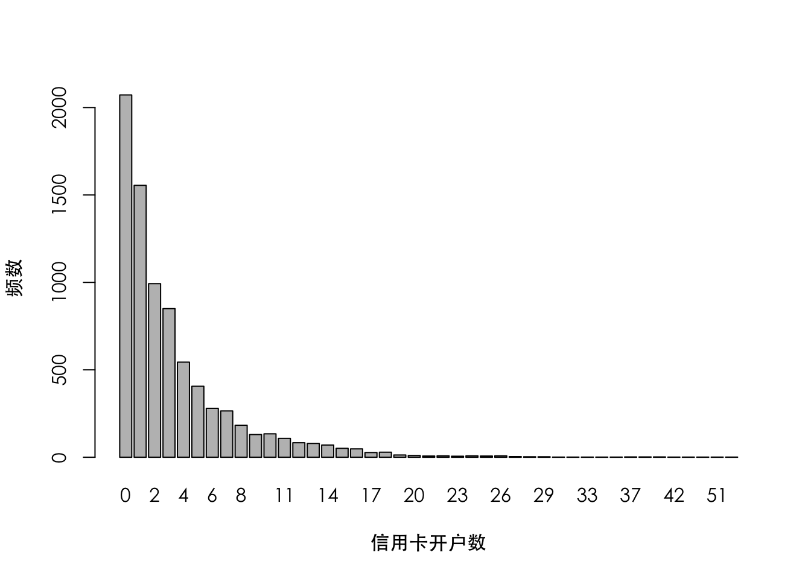

# 定序回归——信用卡逾期还款用户调查

## 案例数据介绍

status（逾期状态）：

    - 1= （1-30）
    - 2= （31-60）
    - 3= （61-90）
    - 4= （91-120）
    - 5= （121-150）
    - 6= （151-180）
    - 7= （180+）

Y1: 是否按期还款

    - 1= 是
    - 0= 否
    
Y2: 逾期严重程度

    - 1= （1-30）
    - 2= （31-60）
    - 3= （61-90）
    - 4= （91+）


```r
a=read.csv("4-mac.csv",header=T)
names(a)=c("gender","usage","credit","loan","history","accounts","status")
a$Y1=1*(a$status>0) ##是否按期还款
a$Y2=a$status ##逾期严重程度
a[c(1:5),]
```

```
##   gender     usage credit loan history accounts status Y1 Y2
## 1   女性 0.9900680   3000    0       0        0      0  0  0
## 2   女性 1.3578084   3000    0       7        3      1  1  1
## 3   男性 1.2766882   5000    0       7        2      3  1  3
## 4   男性 0.7242874   3000 1745       0        0      0  0  0
## 5   男性 1.0739191   2000    0       0       11      0  0  0
```

```r
summary(a)
```

```
##     gender              usage             credit           loan         
##  Length:8000        Min.   : 0.0000   Min.   : 1000   Min.   :     0.0  
##  Class :character   1st Qu.: 0.2887   1st Qu.: 3000   1st Qu.:     0.0  
##  Mode  :character   Median : 0.8379   Median : 4000   Median :     0.0  
##                     Mean   : 0.7373   Mean   : 5173   Mean   :   772.9  
##                     3rd Qu.: 1.1215   3rd Qu.: 5000   3rd Qu.:     0.0  
##                     Max.   :13.0889   Max.   :50000   Max.   :391357.0  
##     history          accounts          status            Y1        
##  Min.   : 0.000   Min.   : 0.000   Min.   :0.000   Min.   :0.0000  
##  1st Qu.: 0.000   1st Qu.: 0.000   1st Qu.:0.000   1st Qu.:0.0000  
##  Median : 0.000   Median : 2.000   Median :1.000   Median :1.0000  
##  Mean   : 1.516   Mean   : 3.365   Mean   :1.445   Mean   :0.6148  
##  3rd Qu.: 2.000   3rd Qu.: 4.000   3rd Qu.:2.000   3rd Qu.:1.0000  
##  Max.   :30.000   Max.   :67.000   Max.   :7.000   Max.   :1.0000  
##        Y2       
##  Min.   :0.000  
##  1st Qu.:0.000  
##  Median :1.000  
##  Mean   :1.445  
##  3rd Qu.:2.000  
##  Max.   :7.000
```

```r
dim(a)
```

```
## [1] 8000    9
```

```r
mean(a$Y1)
```

```
## [1] 0.61475
```


```r
par(family="STHeiti")
par(mfrow=c(1,2))
a1=a[a$Y1==1,]
a1[1:5,]
```

```
##   gender    usage credit loan history accounts status Y1 Y2
## 2   女性 1.357808   3000    0       7        3      1  1  1
## 3   男性 1.276688   5000    0       7        2      3  1  3
## 6   女性 1.173001   3000    0       0        2      3  1  3
## 7   男性 1.030280   5000    0       0        5      6  1  6
## 8   女性 0.945706   4000    0       2        2      1  1  1
```

```r
tab=table(a1$Y2)
barplot(tab,xlab="逾期严重程度",main="合并前")

a$Y2=4*(a$Y2>4)+a$Y2*(a$Y2<=4)
a1=a[a$Y1==1,]
a1[1:5,]
```

```
##   gender    usage credit loan history accounts status Y1 Y2
## 2   女性 1.357808   3000    0       7        3      1  1  1
## 3   男性 1.276688   5000    0       7        2      3  1  3
## 6   女性 1.173001   3000    0       0        2      3  1  3
## 7   男性 1.030280   5000    0       0        5      6  1  4
## 8   女性 0.945706   4000    0       2        2      1  1  1
```

```r
tab=table(a1$Y2)
barplot(tab,xlab="逾期严重程度",main="合并后")
```


### gender


```r
tab=table(a$gender)
tab
```

```
## 
## 女性 男性 
## 2544 5456
```

```r
tab/sum(tab)
```

```
## 
##  女性  男性 
## 0.318 0.682
```

### usage


```r
par(family="STHeiti")
hist(a$usage,xlab="信用卡相对使用率", ylab = "频数",main=NULL)
```


```r
a[a$usage>4,]
```

```
##      gender     usage credit  loan history accounts status Y1 Y2
## 903    男性  6.074610  50000 17268       8        4      3  1  3
## 1333   男性  4.241007   3000 25571       2        4      4  1  4
## 2347   男性  4.683206  10000  6811       9        1      1  1  1
## 2357   女性  6.024418  12000 13799       2       18      1  1  1
## 3135   男性  5.095060   1000  1774       0        4      0  0  0
## 3722   男性  4.293418   1000     0       3       12      2  1  2
## 3805   男性  5.271930   1000     0       0        4      4  1  4
## 6148   女性 13.088921  10000  6550       0        3      3  1  3
## 7069   男性  4.597112   1000     0       0        4      0  0  0
```

```r
a$usage1=1*(a$usage<=1)
tab=table(a$usage1)
tab
```

```
## 
##    0    1 
## 3329 4671
```

```r
tab/sum(tab) 
```

```
## 
##        0        1 
## 0.416125 0.583875
```

### credit


```r
par(family="STHeiti")
par(mfrow=c(1,2))
hist(a$credit,xlab="授信额度（元）", ylab = "频数",main=NULL)
a$credit=log(a$credit)
hist(a$credit,xlab="对数授信额度", ylab = "频数",main=NULL)
```


### loan


```r
a$Z1=1*(a$loan>0)
a$Z2=a$loan
a[a$loan>0,]$Z2=log(a[a$loan>0,]$Z2)
a[1:5,]
```

```
##   gender     usage   credit loan history accounts status Y1 Y2 usage1 Z1
## 1   女性 0.9900680 8.006368    0       0        0      0  0  0      1  0
## 2   女性 1.3578084 8.006368    0       7        3      1  1  1      0  0
## 3   男性 1.2766882 8.517193    0       7        2      3  1  3      0  0
## 4   男性 0.7242874 8.006368 1745       0        0      0  0  0      1  1
## 5   男性 1.0739191 7.600902    0       0       11      0  0  0      0  0
##        Z2
## 1 0.00000
## 2 0.00000
## 3 0.00000
## 4 7.46451
## 5 0.00000
```

```r
mean(a$Z1)
```

```
## [1] 0.169625
```

```r
a2=a[a$Z1==1,]
par(family="STHeiti")
hist(a2$Z2,xlab="对数房贷月供", ylab = "频数",main=NULL)
```


### history


```r
tab=table(a$history)
par(family="STHeiti")
barplot(tab,xlab="历史逾期次数", ylab = "频数",main=NULL)
```


### accounts


```r
tab=table(a$accounts)
par(family="STHeiti")
barplot(tab,xlab="信用卡开户数", ylab = "频数",main=NULL)
```



## 描述统计


```r
mu1=tapply(a$Y1,a$gender,mean)#性别
mu2=tapply(a$Y1,a$usage1,mean)#用信用卡
mu3=tapply(a$Y1,a$Z1,mean)#是否房贷
mu1
```

```
##      女性      男性 
## 0.5534591 0.6433284
```

```r
mu2
```

```
##         0         1 
## 0.7179333 0.5412117
```

```r
mu3
```

```
##         0         1 
## 0.6394701 0.4937362
```


```r
par(family="STHeiti")
par(mfrow=c(1,3))
boxplot(credit~Y1,data=a,ylab="对数授信额度",xlab="是否逾期",names=c("非逾期","逾期"))
boxplot(history~Y1,data=a,ylab="历史逾期次数",xlab="是否逾期",names=c("非逾期","逾期"))
boxplot(accounts~Y1,data=a,ylab="信用卡开户数",xlab="是否逾期",names=c("非逾期","逾期"))
```


```r
par(family="STHeiti")
par(mfrow=c(1,1))
a1=a[a$loan>0,]
boxplot(Z2~Y1,data=a1,ylab="对数月供",xlab="是否逾期",names=c("非逾期","逾期"))
```


### 有逾期的


```r
aa=a[a$Y1==1,]
aa$sex=1*(aa$gender=="男性")

par(family="STHeiti")
par(mfrow=c(1,3))
plot(tapply(aa$sex,aa$Y2,mean),type="b",ylab="男性占比",xlab="逾期严重程度",ylim=c(0,1))
plot(tapply(aa$usage,aa$Y2,mean),type="b",ylab="正常使用率占比",xlab="逾期严重程度",ylim=c(0,1))
plot(tapply(aa$Z1,aa$Y2,mean),type="b",ylab="房贷占比",xlab="逾期严重程度",ylim=c(0,1))
```


```r
par(family="STHeiti")
par(mfrow=c(2,2))
boxplot(credit~Y2,data=aa,ylab="对数授信额度",xlab="逾期严重程度")
boxplot(history~Y2,data=aa,ylab="历史逾期次数",xlab="逾期严重程度")
boxplot(accounts~Y2,data=aa,ylab="信用卡开户数",xlab="逾期严重程度")
aa1=aa[aa$loan>0,]
boxplot(Z2~Y2,data=aa1,ylab="对数月供",xlab="逾期严重程度")
```


## Modeling: Logistic regression (因变量Y1)


```r
model.full=glm(Y1~gender+usage+credit+Z1+Z2+history+accounts,
               family=binomial(link=logit),data=a)
summary(model.full)
```

```
## 
## Call:
## glm(formula = Y1 ~ gender + usage + credit + Z1 + Z2 + history + 
##     accounts, family = binomial(link = logit), data = a)
## 
## Deviance Residuals: 
##     Min       1Q   Median       3Q      Max  
## -4.0363  -1.0495   0.4059   0.9847   2.0931  
## 
## Coefficients:
##              Estimate Std. Error z value Pr(>|z|)    
## (Intercept)  2.530145   0.390839   6.474 9.57e-11 ***
## gender男性   0.259764   0.054136   4.798 1.60e-06 ***
## usage        0.390785   0.056410   6.928 4.28e-12 ***
## credit      -0.366917   0.045951  -7.985 1.41e-15 ***
## Z1           0.499839   0.529408   0.944   0.3451    
## Z2          -0.115344   0.067276  -1.714   0.0864 .  
## history      0.594571   0.023291  25.528  < 2e-16 ***
## accounts     0.008826   0.006232   1.416   0.1567    
## ---
## Signif. codes:  0 '***' 0.001 '**' 0.01 '*' 0.05 '.' 0.1 ' ' 1
## 
## (Dispersion parameter for binomial family taken to be 1)
## 
##     Null deviance: 10665.2  on 7999  degrees of freedom
## Residual deviance:  8914.6  on 7992  degrees of freedom
## AIC: 8930.6
## 
## Number of Fisher Scoring iterations: 5
```

变量选择

$$A I C=\text { Deviance }+2 \times d f$$
$$B I C=\text { Deviance }+\log (n) \times d f
$$


```r
1-pchisq(10665.2-8924.5,df=7) #检验模型显著性
```

```
## [1] 0
```

```r
model.aic=step(model.full,trace=F) #stepwise by AIC
summary(model.aic)
```

```
## 
## Call:
## glm(formula = Y1 ~ gender + usage + credit + Z2 + history, family = binomial(link = logit), 
##     data = a)
## 
## Deviance Residuals: 
##     Min       1Q   Median       3Q      Max  
## -4.0219  -1.0464   0.4037   0.9886   2.0488  
## 
## Coefficients:
##              Estimate Std. Error z value Pr(>|z|)    
## (Intercept)  2.637063   0.385156   6.847 7.56e-12 ***
## gender男性   0.262164   0.054112   4.845 1.27e-06 ***
## usage        0.415324   0.053508   7.762 8.36e-15 ***
## credit      -0.378367   0.045380  -8.338  < 2e-16 ***
## Z2          -0.050523   0.008836  -5.718 1.08e-08 ***
## history      0.591816   0.023187  25.523  < 2e-16 ***
## ---
## Signif. codes:  0 '***' 0.001 '**' 0.01 '*' 0.05 '.' 0.1 ' ' 1
## 
## (Dispersion parameter for binomial family taken to be 1)
## 
##     Null deviance: 10665.2  on 7999  degrees of freedom
## Residual deviance:  8917.4  on 7994  degrees of freedom
## AIC: 8929.4
## 
## Number of Fisher Scoring iterations: 5
```

```r
1-pchisq(10665.2-8925.1,df=6)
```

```
## [1] 0
```

```r
ss=length(a[,1])
model.bic=step(model.full,trace=F,k=log(ss)) #stepwise by BIC
summary(model.bic)
```

```
## 
## Call:
## glm(formula = Y1 ~ gender + usage + credit + Z2 + history, family = binomial(link = logit), 
##     data = a)
## 
## Deviance Residuals: 
##     Min       1Q   Median       3Q      Max  
## -4.0219  -1.0464   0.4037   0.9886   2.0488  
## 
## Coefficients:
##              Estimate Std. Error z value Pr(>|z|)    
## (Intercept)  2.637063   0.385156   6.847 7.56e-12 ***
## gender男性   0.262164   0.054112   4.845 1.27e-06 ***
## usage        0.415324   0.053508   7.762 8.36e-15 ***
## credit      -0.378367   0.045380  -8.338  < 2e-16 ***
## Z2          -0.050523   0.008836  -5.718 1.08e-08 ***
## history      0.591816   0.023187  25.523  < 2e-16 ***
## ---
## Signif. codes:  0 '***' 0.001 '**' 0.01 '*' 0.05 '.' 0.1 ' ' 1
## 
## (Dispersion parameter for binomial family taken to be 1)
## 
##     Null deviance: 10665.2  on 7999  degrees of freedom
## Residual deviance:  8917.4  on 7994  degrees of freedom
## AIC: 8929.4
## 
## Number of Fisher Scoring iterations: 5
```

```r
1-pchisq(10665.2-8927.9,df=5)
```

```
## [1] 0
```

### AUC对比


```r
library(pROC)
```

```
## Type 'citation("pROC")' for a citation.
```

```
## 
## Attaching package: 'pROC'
```

```
## The following objects are masked from 'package:stats':
## 
##     cov, smooth, var
```

```r
pred.full=predict(model.full,data=a)
pred.aic=predict(model.aic,data=a)
pred.bic=predict(model.bic,data=a)

roc.full=roc(a$Y1,pred.full)
```

```
## Setting levels: control = 0, case = 1
```

```
## Setting direction: controls < cases
```

```r
roc.aic=roc(a$Y1,pred.aic)
```

```
## Setting levels: control = 0, case = 1
## Setting direction: controls < cases
```

```r
roc.bic=roc(a$Y1,pred.bic)
```

```
## Setting levels: control = 0, case = 1
## Setting direction: controls < cases
```

```r
print(c(roc.full$auc,roc.aic$auc,roc.bic$auc))
```

```
## [1] 0.7672396 0.7667043 0.7667043
```

```r
par(family="STHeiti")
par(mfrow=c(1,3))
plot(roc.full,main="全模型")
plot(roc.aic,main="AIC模型")
plot(roc.bic,main="BIC模型")
```


## Modeling: 定序回归（因变量Y2,Y1=1）

### 潜变量模型

$$\mathrm{Z}=\mathrm{X}^{\prime} \beta+\varepsilon$$

处理有序分类变量$Y_2$, 希望通过潜变量将自变量与因变量建立联系：

$$\mathrm{Y_2}=\left\{\begin{array}{lll}
1 & \text { 如果 } & \mathrm{Z}<\mathrm{c}_{1} \text { ； } \\
2 & \text { 如果 } & \mathrm{c}_{1} \leq \mathrm{Z}<\mathrm{c}_{2} \\
3 & \text { 如果 } & \mathrm{c}_{2} \leq \mathrm{Z}<\mathrm{c}_{3} \\
4 & \text { 如果 } & \mathrm{c}_{3} \leq \mathrm{Z} \text { ； }
\end{array}\right. 
$$

但这样的划分往往较难实现，参考logistic回归和probit回归思想，对概率$P(Y_2=k)$建模：

$$\mathrm{P}(\mathrm{Y_2}=\mathrm{k})=\left\{\begin{array}{ll}
\Phi\left(\mathrm{c}_{1}-\mathrm{X}^{\prime} \beta\right) & \text { 如果 } \mathrm{k}=1 \text { ； } \\
\Phi\left(\mathrm{c}_{2}-\mathrm{X}^{\prime} \beta\right)-\Phi\left(\mathrm{c}_{1}-\mathrm{X}^{\prime} \beta\right) & \text { 如果 } \mathrm{k}=2 \text { ； } \\
\Phi\left(\mathrm{c}_{3}-\mathrm{X}^{\prime} \beta\right)-\Phi\left(\mathrm{c}_{2}-\mathrm{X}^{\prime} \beta\right) & \text { 如果 } \mathrm{k}=3 \text { ； } \\
1-\Phi\left(\mathrm{c}_{3}-\mathrm{X}^{\prime} \beta\right) & \text { 如果 } \mathrm{k}=4 \text { 。 }
\end{array}\right.
$$

需要处理此参数估计问题。常用的方法有极大似然估计。似然函数：

$$\prod_{\mathrm{i}=1}^{n} \mathrm{P}\left(\mathrm{Y}_{\mathrm{i}} \mid \mathrm{X}_{\mathrm{i}}\right)=\prod_{\mathrm{i}=1}^{\mathrm{n}} \prod_{\mathrm{k}=1}^{3}\left\{\mathrm{q}_{\mathrm{k}}\left(\mathrm{X}_{\mathrm{i}}^{\prime} \beta, \mathrm{c}\right)\right\}^{\mathrm{I}\left(\mathrm{Y}_{\mathrm{i}}=\mathrm{k}\right)},$$

对数似然函数：

$$\mathcal{L}(\beta)=\sum_{\mathrm{i}=1}^{\mathrm{n}} \log \left\{\mathrm{P}\left(\mathrm{Y}_{\mathrm{i}} \mid \mathrm{X}_{\mathrm{i}}\right)\right\}=\prod_{\mathrm{i}=1}^{\mathrm{n}} \prod_{\mathrm{k}=1}^{3} \mathrm{I}\left(\mathrm{Y}_{\mathrm{i}}=\mathrm{k}\right) \log \left\{\mathrm{q}_{\mathrm{k}}\left(\mathrm{X}_{\mathrm{i}}^{\prime} \beta, \mathrm{c}\right)\right\} .$$

数学推导此处略。


```r
library(MASS)
probit.full=polr(as.factor(Y2)~gender+usage+credit+Z1+Z2+history+accounts,method="probit",Hess=T,data=aa)
summary(probit.full)
```

```
## Call:
## polr(formula = as.factor(Y2) ~ gender + usage + credit + Z1 + 
##     Z2 + history + accounts, data = aa, Hess = T, method = "probit")
## 
## Coefficients:
##                Value Std. Error  t value
## gender男性  0.067676   0.034031  1.98867
## usage       0.001008   0.031370  0.03215
## credit     -0.105923   0.029567 -3.58249
## Z1          0.447592   0.366074  1.22268
## Z2         -0.067041   0.046899 -1.42947
## history     0.054991   0.005488 10.02097
## accounts    0.021823   0.003507  6.22336
## 
## Intercepts:
##     Value   Std. Error t value
## 1|2 -1.3560  0.2492    -5.4403
## 2|3 -0.2384  0.2488    -0.9585
## 3|4  0.5552  0.2492     2.2285
## 
## Residual Deviance: 12612.62 
## AIC: 12632.62
```


```r
tab = as.data.frame(coefficients(summary(probit.full))) 
tab$p.value = round(2*(1-pnorm(abs(tab$`t value`))),3)
tab
```

```
##                   Value  Std. Error     t value p.value
## gender男性  0.067675543 0.034030575  1.98866881   0.047
## usage       0.001008471 0.031370456  0.03214714   0.974
## credit     -0.105922643 0.029566760 -3.58249076   0.000
## Z1          0.447591651 0.366074441  1.22267933   0.221
## Z2         -0.067040877 0.046899044 -1.42947214   0.153
## history     0.054991103 0.005487604 10.02096774   0.000
## accounts    0.021822732 0.003506581  6.22336419   0.000
## 1|2        -1.355979677 0.249246544 -5.44031486   0.000
## 2|3        -0.238444897 0.248763005 -0.95852234   0.338
## 3|4         0.555234401 0.249155346  2.22846674   0.026
```


```r
probit.null = polr(as.factor(Y2)~1,method="probit",Hess=T,data=aa)
summary(probit.null)
```

```
## Call:
## polr(formula = as.factor(Y2) ~ 1, data = aa, Hess = T, method = "probit")
## 
## No coefficients
## 
## Intercepts:
##     Value    Std. Error t value 
## 1|2  -0.7007   0.0196   -35.8202
## 2|3   0.3910   0.0184    21.2785
## 3|4   1.1641   0.0230    50.5037
## 
## Residual Deviance: 12802.75 
## AIC: 12808.75
```

```r
1-pchisq(12802.75 - 12612.04,df=7)
```

```
## [1] 0
```

### stepwise by AIC


```r
probit.aic=step(probit.full,trace=F)
summary(probit.aic)
```

```
## Call:
## polr(formula = as.factor(Y2) ~ gender + credit + Z2 + history + 
##     accounts, data = aa, Hess = T, method = "probit")
## 
## Coefficients:
##               Value Std. Error t value
## gender男性  0.06797   0.034029   1.997
## credit     -0.11018   0.029279  -3.763
## Z2         -0.01018   0.005985  -1.701
## history     0.05495   0.005364  10.244
## accounts    0.02171   0.003374   6.436
## 
## Intercepts:
##     Value   Std. Error t value
## 1|2 -1.3927  0.2445    -5.6952
## 2|3 -0.2755  0.2440    -1.1288
## 3|4  0.5181  0.2444     2.1201
## 
## Residual Deviance: 12614.12 
## AIC: 12630.12
```

```r
tab = as.data.frame(coefficients(summary(probit.aic))) 
tab$p.value = round(2*(1-pnorm(abs(tab$`t value`))),3)
tab
```

```
##                  Value  Std. Error   t value p.value
## gender男性  0.06797161 0.034028748  1.997476   0.046
## credit     -0.11018441 0.029278501 -3.763321   0.000
## Z2         -0.01017686 0.005984539 -1.700526   0.089
## history     0.05494709 0.005363807 10.244047   0.000
## accounts    0.02171411 0.003373886  6.435935   0.000
## 1|2        -1.39272777 0.244544133 -5.695200   0.000
## 2|3        -0.27545588 0.244027704 -1.128789   0.259
## 3|4         0.51807676 0.244364187  2.120101   0.034
```

```r
1-pchisq(12802.75 - 12614.12,df=5)
```

```
## [1] 0
```

### stepwise by BIC


```r
ss2=length(aa[,1])
probit.bic=step(probit.full,trace=F,k=log(ss2))
summary(probit.bic)
```

```
## Call:
## polr(formula = as.factor(Y2) ~ credit + history + accounts, data = aa, 
##     Hess = T, method = "probit")
## 
## Coefficients:
##             Value Std. Error t value
## credit   -0.12271   0.028166  -4.357
## history   0.05542   0.005358  10.345
## accounts  0.02112   0.003334   6.334
## 
## Intercepts:
##     Value   Std. Error t value
## 1|2 -1.5344  0.2361    -6.5001
## 2|3 -0.4181  0.2354    -1.7760
## 3|4  0.3752  0.2358     1.5914
## 
## Residual Deviance: 12621.05 
## AIC: 12633.05
```

```r
tab = as.data.frame(coefficients(summary(probit.bic))) 
tab$p.value = round(2*(1-pnorm(abs(tab$`t value`))),3)
tab
```

```
##                Value  Std. Error   t value p.value
## credit   -0.12270807 0.028166195 -4.356572   0.000
## history   0.05542479 0.005357707 10.344871   0.000
## accounts  0.02111930 0.003334170  6.334198   0.000
## 1|2      -1.53438168 0.236054863 -6.500106   0.000
## 2|3      -0.41812594 0.235431197 -1.776001   0.076
## 3|4       0.37517650 0.235753519  1.591393   0.112
```

```r
1-pchisq(12802.75 - 12621.05,df=3)
```

```
## [1] 0
```

## 预测

### 0-1模型预测


```r
new = data.frame(gender="男性",usage=1,credit=log(20000),loan=4000,
                 history=4,accounts=3,Z1=1,Z2=log(4000))
pred=predict(model.bic,newdata=new)
exp(pred)/(1+exp(pred))
```

```
##         1 
## 0.8198925
```

```r
dat = data.frame(prediction = exp(predict(model.bic,a))/(1+exp(predict(model.bic,a)))) 
summary(dat)
```

```
##    prediction    
##  Min.   :0.1226  
##  1st Qu.:0.4486  
##  Median :0.5736  
##  Mean   :0.6148  
##  3rd Qu.:0.7952  
##  Max.   :1.0000
```

### 定序回归模型预测

```r
predict(probit.bic,newdata=new)
```

```
## [1] 2
## Levels: 1 2 3 4
```

