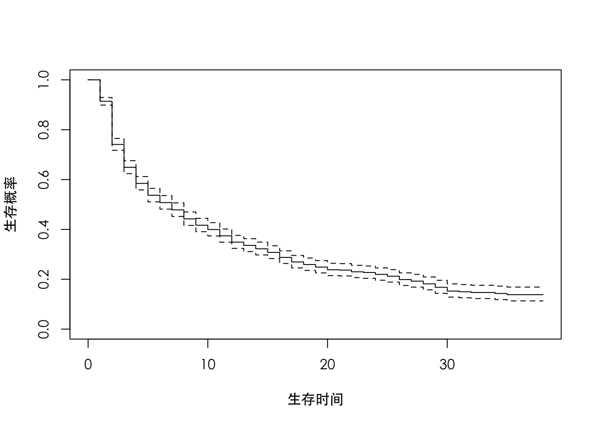
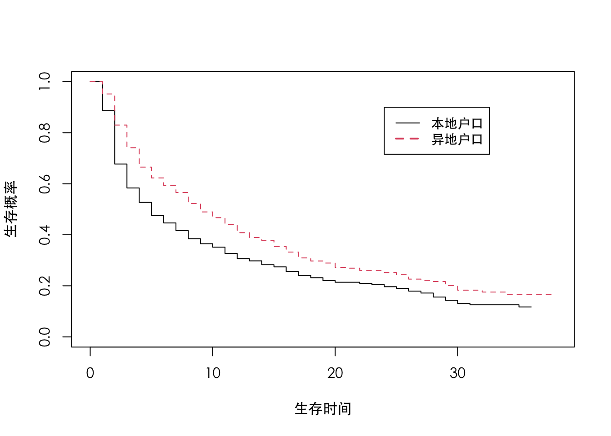
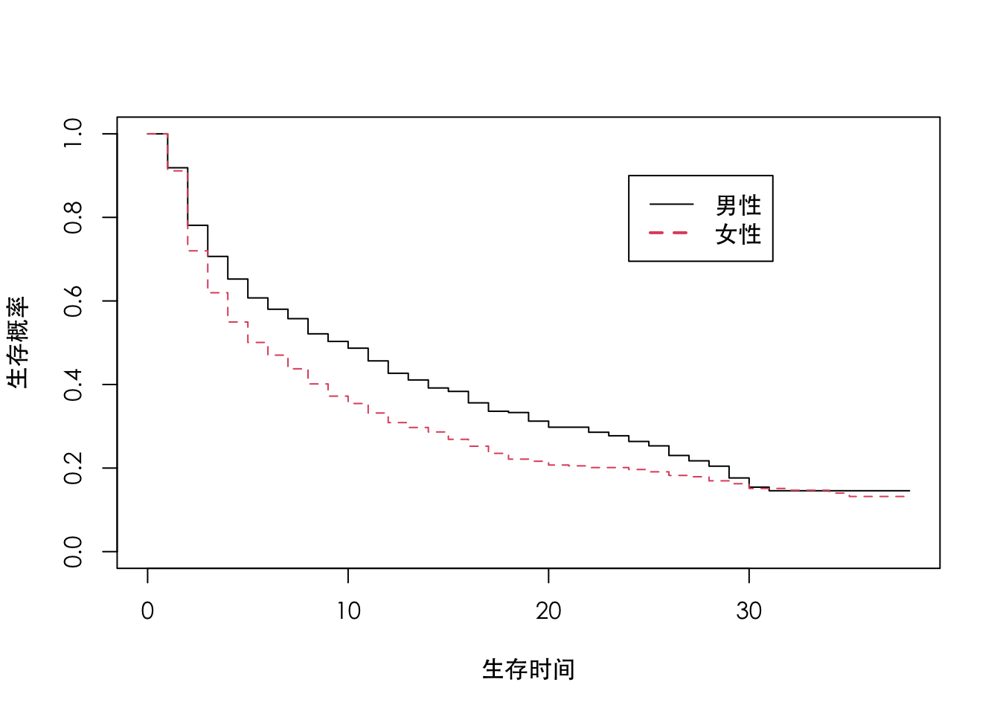
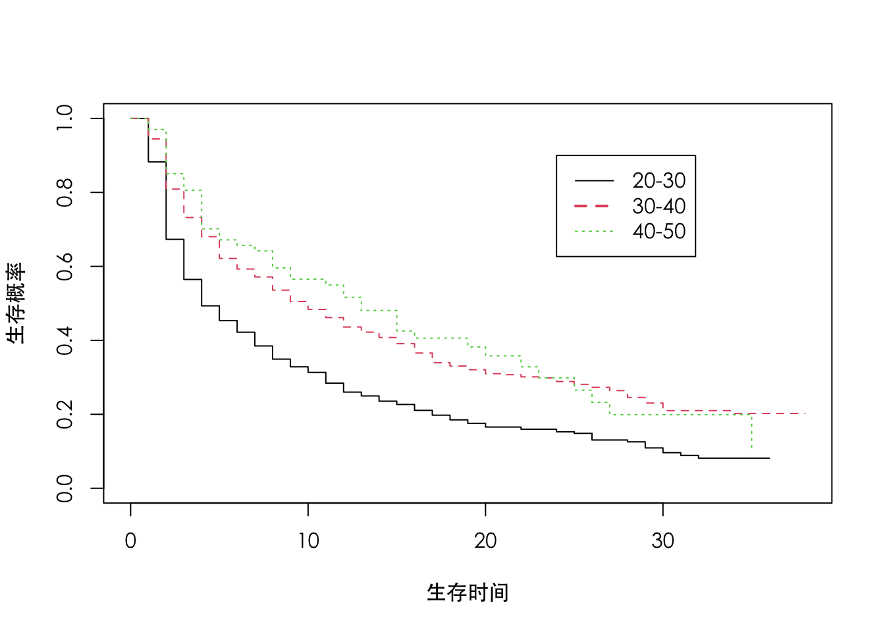
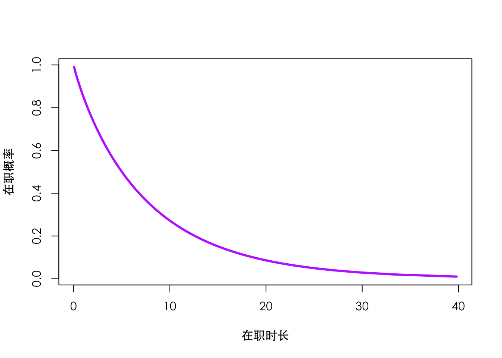

# 生存分析——员工离职前工作时长的研究

## 背景介绍

前面有几章反复提到, 顾客是企业重要的无形资产。员工又何尝不是 呢? 甚至更加重要。曾经有人问一位国际知名的企业总裁: 您是怎样让顾客 满意的? 他的回答大意如下: 我的工作是让我的员工满意, 为此我为他们创 造最好的工作条件、最优厚的福利待遇。只要他们开心了, 他们会想办法让 我的顾客开心。由此可见员工在企业成长发展过程中的巨大作用。

一方面, 现代商业社会竞争激烈, 企业的核心员工往往掌握着重要的客 户资源、技术秘密, 或者至少也是熟悉该企业的文化氛围的。一旦离职, 会 对企业造成一定的损失, 甚至是致命伤。而另一方面, 通过更好的待遇条件 获得竞争对手的核心人员, 不失为一种成长的捷径。尤其是对于成长中的中 小企业, 它们缺少人才积累, 承受着巨大的市场竞争压力, 没有时间等待。 因此, “挖” 竞争对手的 “墙脚” 大概是不可避免的方式。当然, 这些企业 自己也面临被别人 “挖墙脚” 的压力。如果一个重要员工离职, 而企业需要 找到一个合适的替代, 有哪些成本呢? 首当其冲的是时间。时间不仅仅是金 钱, 更重要的是意味着商业机遇, 失之不再来。其次, 是货币成本。如果通 过一个猎头公司获得一个重要员工, 企业一般要给猎头公司支付等同于该员 工三个月薪酬的费用。这可不是一笔可以忽略的费用!

那么企业应该靠什么留住员工呢? 作者曾经就这一问题请教过很多企业 高管, 得到过很多不同的答案。其中, 有一个答案被很多人重复提到, 那就 是: 事业留人、待遇留人, 还有感情留人。对员工来讲, 企业的前景是极其 重要的。一个发展缓慢的企业不可能为员工创造更多上升提高的机会, 因 此, 无法提供一个美丽的职业蓝图。当然, 除了有一份美好的事业前景以 外, 优厚的待遇也是很重要的。美好的事业前景在一定程度上能够抵消员工 当前对待遇的要求, 他们将此要求寄托在了企业的美好明天上面。但明天终 归是明天, 当前的企业薪酬水平以及设计对稳定员工队伍很重要。最后一条 “感情留人” 是比较有中国特色的。用时髦的话说, 就是企业文化。它有丰 富的内涵, 包括企业领导的管理风格等, 它关注的核心就是员工在企业工作 得开心与否。

企业一方面要努力为员工创造良好的条件, 另一方面也要在招聘人才时有所甄别。为什么同样的公司、同样的前景、同样的薪酬、同样的工作, 有 的员工就工作得非常开心、信心十足, 而有的员工就垂头丧气, 天天想着跳 槽。俗话说, 一个巴掌拍不响。员工的离职有企业的原因, 也有员工自己的 原因。作为人力资源主管, 控制员工的招募过程, 尽量招到同本企业文化肦 围相适应的员工，对于稳定企业员工队伍无疑是很有邦助的。
但是, 如何才能够知道哪些员工同本企业更适应, 因此工作时间会更 长? 这需要结合工作经验, 对企业过去的离职员工数据做认真分析。对于该 问题, 我们关心的因变量是员工在企业的工作时间。如果把一个员工加人企 业看作 “出生”, 而离职看作 “死亡”, 那么他的工作时间就是其 “生存时 间”。因此, 需要用下面的生存数据的分析方法, 仔细研究该问题。

## 数据介绍

本案例的数据来源于国内某大型商业银行人力资源部门, 共有 1300 个 样本。每一个样本对应于该银行当年的一位销售人员。这些销售人员的主要 工作是销售信用卡, 因此对他们的学历、工作经验等要求都不高, 但是相应 的离职率也很高。如果数据表明该员工离职, 是指当年离职。具体地说, 我 们详细记录了以下信息。

### 工作年限  (Y) 
这是我们关心的因变量, 它记录的是某个员工已经在企业工作了多长时 间, 以月计。值得一提的是, 这并不代表  Y  就是我们所说的生存时间（survival time)。因为对于那些已经彻底离职的员工, 该变量确实代表着他的生 存时间; 但是, 对于那些还没有离职的员工, 无法确定在末来的什么时间他 们会离职, 他们的生存时间大于或者等于已经实现了的工作时间  Y  。

### 是否离职  (C) 
这是一个  0-1  变量。  C=1  表示该员工已经离职, 相反  C=0  表示该员 工仍然在职。这个变量极其重要, 是对因变量  Y  的一个重要补充。或者说,  Y  和  C  一起才构成了因变量。生存数据（survival data）之所以被称为生存 数据, 主要是因为  Z  的存在。假设一个员工的真实生存时间为  Z , 那么
 C=1  表示该员工已经离职, 这时  Y  就是真正的生存时间, 即  Y=Z ; 但是, 如果  C=0 , 我们知道  Y  不是真实的生存时间, 而真实的生存时间必须是  $Z \geqslant Y$  。因此,  Y  是一个被截断 (censored) 的数据。截断是生存数据的最本 质特点, 不是 “生存” 本身。例如, 如果这里没有截断, 我们精确地看到了 真实的生存时间  Z , 那么因为生存时间是一个非负的连续数字, 因此对  $\log (Z)$  做一个普通的线性回归就非常好了, 没有必要费劲讨论下面的生存 分析方法。
 
前面介绍的是该数据的因变量, 下面介绍解释变量。


### 户籍  $\left(X_1\right)$ 
这是一个定性变量, 有两个可能的取值, 即异地还是本地。有的研究报 告表明, 对某些企业而言, 本地员工离职的可能性更大, 因为本地员工所掌 握的本地社会资源相对丰富, 面临更多的选择。但也有研究报告显示, 异地 员工有可能只是将现在的工作作为一个临时过渡, 他们可能对那些能够为其 解决户口的单位更感兴趣。

### 性别  $\left(X_2\right)$ 
这也是一个定性变量, 有两个可能的取值, 即男或女。我们有足够的理 由相信性别的重要性。例如, 某些工作需要比较大的体力投人, 不适合女 性, 那么女性的离职率可能就要高一些; 相反, 有的工作 (如幼教), 通常 女性参与得多一些, 男性员工的适应性就要相对差一些。对于本案例的银 行, 性别能否产生足够影响目前无从知晓。

### 年龄  $\left(X_3\right)$ 
这是一个定量变量, 记录的是员工当时的年龄。如果认为斍目的跳槽尝 试是年轻人的专利, 那么年龄大一些的员工有可能渴望稳定, 因此离职率会 偏低。但是, 也有一种不同的说法, 那就是员工的年龄越大, 经验越丰富, 越有可能成为竞争对手争夺的对象, 因此离职率会更高。
以上便是本案例所采集到的所有变量和指标, 非常简单, 但也不完全, 很多重要的公司层面的指标没有放进去, 如薪酬设计、教育培养、工作部门 等。这里我们仅仅希望起到抛砖引玉的作用, 希望大家能够做得更好。

## 描述分析

同前面几章一样, 首先对数据做描述分析。但不同的是, 生存数据的描 述分析不大容易, 至少对于初学者来说是这样。这主要是因为生存数据常常 被截断, 对于被截断的数据, 它到底应该算做多少不清楚。例如, 工作时间 为 12 个月的在职员工, 末来他到底能够工作多长时间谁也不清楚, 只知道 大于等于 12 个月。因此, 传统的基于完整数据的统计量都不再适用 (如均 值、方差), 我们需要一个新的描述量来解决该问题, 即生存函数。具体地 说, 我们关注真实的生存时间  Z , 然后定义其相关的生存函数为  $S(t)=P(Z>t)$  。接下来的目标就是要估计  $S(t)$  。因为有很多生存数据被截断, 因 此不可能把整个生存函数估计出来。但能够估计出很大一部分, 通常这部分 足够大, 能够覆盖中位数。因此, 对平均生存时间的判断, 我们更多地谈到 中位数, 而不是均值。

具体地说, 我们用  $\left(Y_{i}, C_{i}, Z_{i}\right)$  代表来自第  i  个  $(1 \leqslant i \leqslant n)$  个体的数 据, 其中  $Y_{i}$  是观测到的生存时间,  $C_{i}$  是一个  0-1  变量, 表明该观测的生 存状态,  $Z_{i}$  代表的是真实生存时间。因此如果  $C_{i}=1$ , 有  $Y_{i}=Z_{i}$ ; 相反, 如 果  $C_{i}=0$ , 有  $Y_{i} \leqslant Z_{i}$  。那么应该如何估计  $S(t)$  呢? 首先定义两个重要概念。 一个是在险者 (subjects at risk), 另外一个叫做事件 (event)。对于一个任 意给定的时间  t , 对我们的案例而言, 它指的就是在职时间已经超过  t  月的 个体。这样就排除了两种个体: 一类是真实在职时间不到  t  月的样本, 这部 分样本已经离职, 而且离职时在职时间不够  t  月。另外一类是真实在职时间 也许能够达到  t  月, 但因为人职时间太短, 还没有表现出来。例如  t=12  月, 而一个员工加人公司才 6 个月, 还没有离职, 那么我们知道他的真实生 存时间大于等于 6 个月, 也许他将在末来为公司工作 24 个月, 但目前无法 判定, 我们仅仅看到他过去的 6 个月。对这部分样本, 尚难以判定, 因此, 将它们也排除在外。为了叙述方便, 我们用数学符号  R(t)  来代表这些个体 的数目。考虑条件概率  $P(Z>t+\Delta t \mid Z>t)$  应该如何估算, 其中,  $\Delta t$  代表 的是一个足够小的量, 使得在时间段  $(t, t+\Delta t)$  内没有任何个体被截断。 在这个前提下, 该概率可以通过下面的公式估计:

$$P(Z>t+\Delta t \mid Z>t)=\frac{P(Z>t+\Delta t)}{P(Z>t)} \approx \frac{(t, t+\Delta t) \text { 时刻内的事件个数 }}{t \text { 时刻的在险者个数 }}$$

简单地说,  $(t, t+\Delta t)$  时刻内的事件个数反映的就是在职时间介于  $t$  和  $t+\Delta t$  之间的个体的个数。如果  $\Delta t$  足够小, 这等价于说在  t  时刻 “死亡” 的 个体数目。对本案例而言, 就是在职时间为  t  的个体数目。为方便起见, 用  $\varepsilon(t)$  代表该数目。
如果能够对任意一个时刻  t  估计出条件概率  $P(Z>t+\Delta t \mid Z>t)$ , 这等 价于估计出了整个生存函数  $S(t)$  。对于一个实际数据, 我们看到的 “死亡” 时间是离散的 (虽然理论上是连续的), 因此对于绝大多数时刻  t  而言,  $\varepsilon(t)=0$ , 进而有  $P(Z>t+\Delta t \mid Z>t)=1$  。这说明对于有限样本来说,  $S(t)=S(t+\Delta t)$  。因此, 生存函数  $S(t)$  的取值只可能在有事件发生的时间 点发生变化。把所有的这样的时间点收集起来构成集合  $T=\{t  : 存在一个个体  i , 使得  \left.Y_{i}=t, C_{i}=0\right\}$  。然后, 对于一个任给的时间点  t , 估计  $S(t)$  如下:

$$S(t)=\prod_{t_{i} \leqslant t}^{t_{i} \in T} P\left(Y>t_{i} \mid Y \geqslant t_{i}\right) \approx \prod_{t_{i} \leqslant t}^{t_{i} \in T}\left\{1-\frac{\varepsilon\left(t_{i}\right)}{R\left(t_{i}\right)}\right\}=\hat{S}(t)$$

这就是著名的 Kaplan-Meier (KM) 估计。对于一个给定的时刻  t , 标 准的统计学理论已经告诉我们该估计量是相合一致的、斩进无偏的, 而且是 极限正态的。相应的标准误差为:

$$\operatorname{var}[\hat{S}(t)] \approx \hat{S}^{2}(t) \sum_{t_{i} \leqslant t}^{t_{i} \in T} \frac{\varepsilon\left(t_{i}\right)}{R\left(t_{i}\right)\left\{R\left(t_{i}\right)-\varepsilon\left(t_{i}\right)\right\}}$$

基于此公式, 置信区间就可以构造出来。

## 原始数据


```r
a=read.csv("6-mac.csv",header=T)
nrow(a)
```

```
## [1] 1300
```

```r
names(a)=c("hk","gender","age","Y","C")
a$age2=floor(a$age/10)
a[c(1:5),]
```

```
##     hk gender age  Y C age2
## 1 异地     男  29 10 1    2
## 2 本地     男  34 25 0    3
## 3 异地     女  22 31 1    2
## 4 本地     女  36  5 1    3
## 5 本地     男  28 19 0    2
```

```r
c(dim(a),mean(a$Y))
```

```
## [1] 1300.00000    6.00000   10.01077
```

```r
1-mean(a$C) #截断数据
```

```
## [1] 0.2269231
```

### 处理：生存数据


```r
library(survival)
a$YS=Surv(a$Y,a$C)
a[1:5,]
```

```
##     hk gender age  Y C age2  YS
## 1 异地     男  29 10 1    2  10
## 2 本地     男  34 25 0    3 25+
## 3 异地     女  22 31 1    2  31
## 4 本地     女  36  5 1    3   5
## 5 本地     男  28 19 0    2 19+
```

```r
head(a$YS,100)
```

```
##   [1] 10  25+ 31   5  19+ 23+ 15   3  35+ 19+ 31+ 16  15  17  12   9  17+ 11 
##  [19]  4  16+ 17+  8   5   7  20+  2  12+  2   6   2   3  19+  3   3   7  36+
##  [37] 11+ 18+ 18+ 10  18+  9   7   9  28+ 17  27  13+ 12+  4  29  35  26+ 26 
##  [55] 36+ 36+ 26  24+ 24+ 27  10  16  15  11  24+ 27+ 17  16  17  17  17+ 28+
##  [73] 35+ 30  35+ 28+ 35+ 26+ 14  20   8  12  24+ 26  19+  9  37+ 30  33+ 35+
##  [91] 24  19  24+ 25+ 24+ 17  20+ 12  10  16
```
例如, 如果该数据被截断的比例很小, 那么真实的生存时间就会很接近  10.0  个月; 如果数据被截断的比例很大, 真实的生存数据就会高出  10.0  个 月很多, 高出的程度很难确定。这就解释了为什么这个  10.0  个月没有特别 大的实际意义。从上面的输出结果我们还可以看到, 总样本是  n=1300  个, 其中 295 个被截断, 占总样本的  22.69 \%  。这说明, 在不长的一段时间内,绝大多数样本的真实 “死亡” 时间都被准确观测到, 即相应的雇员离职。离 职雇员占总样本的  1-22.69 \%=77.31 \%  。这是一个巨大的比例, 值得 关注。

除了基本的数据描述以外, SAS 还计算了生存函数的 KM 估计。从中 可以看到, 如果以中位数计, 平均的员工在职时间极短, 只有 5 个月左右。 但上文说到即使被低估, 员工的平均在职时间也有  11.3  个月, 这似乎非常 矛盾。其实不然。 5 个月是中位数,  11.3  个月说的是平均数。对于大多数数 据而言, 平均数和中位数差别不是那么大。本案例差别如此之大说明 “生存 时间” 是一个严重右偏的数据。通俗地讲, 这代表着一个员工的在职时间要 么很短, 要么超过一定阈值 (如 6 个月) 后, 就会变得很长。该分析的实践 意义在于告诉管理者新雇员的前 6 个月很重要。
上面的分析虽然很直观、很好地描述了因变量, 但是没有和解释变量结 合起来。以第一个解释变量户籍为例, 我们可以把所有样本按照是异地还是 本地分组, 然后分别计算 KM 估计, 最后做对比分析。在 SAS 中, 可以实 现如下:从上表可以看出, 本地、异地的样本分布相对均匀（541 对 759), 没有 严重的问题。各组的截断比例也可比 ($26.25\%$对  $20.16 \%$)  。然后, SAS 会对该因素（即户籍）对生存函数的影响能力做出判断。 值得注意的是, 该判断是在忽略其他解释变量 (即性别、年龄) 的情况下做 出的, 因此, 有一定的参考意义, 但不是最终答案。SAS 为此提供了三种 不同的检验结果, 两种非参数检验 (Log-Rank, Wilcoxon)、一种参数检验 即  $-2 \log(LR)$。对于本案例而言, 用哪一个检验都不重要, 因为都高度显 著, 这说明本地异地员工的离职可能性确实有可能不同。作者有限的经验表 明, 似乎 Log-Rank 检验在实际中（特别是医学研究中）采用得更多一些, 该检验同有名的 Cox 等比例风险模型紧密相关。虽然前面的分析有助于我们判断本地异地员工的离职率确实不同, 但无 法告诉我们到底哪一个高。从上图汇报的 KM 生存函数估计中我们可以找 到答案。因为实践的生存函数 (即本地) 一致地落在了虚线生存函数（即异 地）的上方。这说明, 在任意的一个时间点上, 本地员工的生存概率都要高 于异地员工。所以, 他们的离职率应该偏低。类似地, 我们也可以对性别做 同样的分析, 如下图所示, 我们发现男性员工离职可能性更高。最后, 我们把所有员工按照年龄每 10 年为一个单位分成三组, 其中  g=2  表示  $20 \sim 30$, $g=3$  表示  $31 \sim 40$, $g=4$  表示 41 及以上。结果如下图 所示:从中不难发现, 年龄对员工的生存函数影响也不小。年龄越小, 越容易 离职。尤其是  $20 \sim 30$  岁组（即  $g=2$  ), 它的生存概率明显小于其他两组。 而其他两组差别没有那么大。这提示我们, 也许雇用 30 岁以上的员工, 更 有可能获得较长的在职时间。

## 生存（KM）曲线


```r
km.fit=survfit(a$YS~1)
summary(km.fit)
```

```
## Call: survfit(formula = a$YS ~ 1)
## 
##  time n.risk n.event survival std.err lower 95% CI upper 95% CI
##     1   1300     112    0.914 0.00778        0.899        0.929
##     2   1188     225    0.741 0.01215        0.717        0.765
##     3    963     119    0.649 0.01324        0.624        0.676
##     4    844      84    0.585 0.01367        0.558        0.612
##     5    760      62    0.537 0.01383        0.510        0.565
##     6    698      38    0.508 0.01387        0.481        0.536
##     7    660      38    0.478 0.01385        0.452        0.506
##     8    621      47    0.442 0.01378        0.416        0.470
##     9    572      33    0.417 0.01368        0.391        0.444
##    10    535      22    0.400 0.01360        0.374        0.427
##    11    504      32    0.374 0.01345        0.349        0.402
##    12    445      30    0.349 0.01331        0.324        0.376
##    13    398      15    0.336 0.01323        0.311        0.363
##    14    372      15    0.322 0.01315        0.298        0.349
##    15    354      16    0.308 0.01305        0.283        0.334
##    16    336      22    0.288 0.01289        0.263        0.314
##    17    301      19    0.269 0.01273        0.246        0.296
##    18    262      10    0.259 0.01265        0.236        0.285
##    19    229       9    0.249 0.01260        0.225        0.275
##    20    205       9    0.238 0.01256        0.215        0.264
##    21    186       1    0.237 0.01256        0.213        0.263
##    22    174       5    0.230 0.01256        0.207        0.256
##    23    165       2    0.227 0.01257        0.204        0.253
##    24    148       5    0.219 0.01260        0.196        0.246
##    25    121       4    0.212 0.01270        0.189        0.239
##    26    110       7    0.199 0.01287        0.175        0.226
##    27     95       3    0.192 0.01297        0.169        0.220
##    28     89       5    0.182 0.01311        0.158        0.209
##    29     78       6    0.168 0.01328        0.144        0.196
##    30     67       6    0.153 0.01343        0.128        0.181
##    31     56       1    0.150 0.01347        0.126        0.179
##    32     50       1    0.147 0.01353        0.123        0.176
##    34     37       1    0.143 0.01373        0.118        0.173
##    35     30       1    0.138 0.01408        0.113        0.169
```

```r
par(family = "STHeiti")                         #设置字体

plot(km.fit,xlab="生存时间",ylab="生存概率")
```



```r
plot(survfit(YS~hk,data=a),col=c(1,2),lty=c(1,2),xlab="生存时间",ylab="生存概率")
legend(24,0.9,c("本地户口","异地户口"),col=c(1,2),lty=c(1,2),lwd=c(1,2),cex=0.9)
```



```r
plot(survfit(YS~gender,data=a),col=c(1,2),lty=c(1,2),xlab="生存时间",ylab="生存概率")
legend(24,0.9,c("男性","女性"),col=c(1,2),lty=c(1,2),lwd=c(1,2),cex=1)
```



```r
plot(survfit(YS~as.factor(age2),data=a),col=c(1,2,3),lty=c(1,2,3),xlab="生存时间",ylab="生存概率")
legend(24,0.9,c("20-30","30-40","40-50"),col=c(1,2,3),lty=c(1,2,3),lwd=c(1,2),cex=1)
```



## Modeling: 加速失效模型

前面的描述分析给了我们很多有益的启发。它似乎在说所有的解释变量 都对因变量有不平凡的影响作用, 但遗㨔的是描述统计无法把所有变量作为 一个整体放在一起分析。因此, 接下来将重点讨论基于生存数据的回归模型 分析。
应该如何构造一个合理的生存数据模型呢? 我们考虑一个理想情形, 那 就是真实的生存时间  Z  是观测到的。而真实的生存时间是一个非负的连续 数据, 我们可以通过一个对数变换, 把它转换到正负无穷之间。在此基础 上, 做普通线性模型如下:

$$\log (Z)=X^{\prime} \beta+\varepsilon=\beta_{0}+\beta_{1} X_{1}+\beta_{2} X_{2}+\beta_{3} X_{3}+\varepsilon$$

同普通线性模型类似，我们也可以假设随机扰动项服从一个均值为 0 的 正态分布, 但这会使计算变得复杂。在计算机技术发达的今天, 虽然这已不 算什么问题, 但在几十年前, 还是会给人们带来很大困难的, 因此, 传统上 人们更习惯假设  $\exp (\varepsilon)$  服从一个指数或者 Weibull 分布。为了讨论方便, 本章假设  $\exp (\varepsilon)$  服从一个标准指数分布。然后定义  $Z_{0}=\exp (\varepsilon)$ , 这代表的 是在没有解释变量影响的情况下的基准生存时间。但是, 在解释变量  X  的 影响下, 真实的生存时间便为  $Z_{0} \exp \left(X^{\prime} \beta\right)$  。也就是说, 在原来的基准生存 时间  $Z_{0}$  上, 乘以一个加速 (如果  $\exp \left(X^{\prime} \beta\right)<1$  ) 因子  $\exp \left(X^{\prime} \beta\right)$  。因此, 人 们习惯称此模型为加速失效 (accelerated failure time, AFT) 模型。这就是 本章要介绍的生存回归模型。
对该模型, 我们应该如何估计末知参数呢? 答案仍然是极大似然估计。 更加具体地说, 如果  C=1 , 真实的生存时间是观测到的, 即  Y=Z  。那么,  Y  服从的是一个参数为  $\exp \left(X^{\prime} \beta\right)$  的指数分布。因此, 相应的似然函数为:  $\exp \left(X^{\prime} \beta\right) \exp \left\{-Y \times \exp \left(-X^{\prime} \beta\right)\right\}$  。但是, 如果  C=0 , 那么真实的生存时间 是没有观测到的, 即  $Y \leqslant Z$  。因此, 相应的生存函数为  $P(Z>Y)=  \exp \left\{-Y \times \exp \left(-X^{\prime} \beta\right)\right\}$  。因此, 如果假设  $\left(Y_{i}, X_{i}, C_{i}\right)$  代表来自第  i  个样 本的数据, 相应的似然函数为:

$$\prod_{i=1}^{n}\left\{\exp \left(X_{i}^{\prime} \beta\right)\right\}^{\left.I C_{i}=1\right)} \exp \left\{-Y_{i} \times \exp \left(-X_{i}^{\prime} \beta\right)\right\}$$

对它做对数变换后, 得到对数似然函数为:

$$\mathcal{L}(\beta)=\sum_{i=1}^{n} I\left(C_{i}=1\right) X_{i}^{\prime} \beta-Y_{i} \times \exp \left(-X_{i}^{\prime} \beta\right)$$

然后可以通过极大化该对数似然函数获得极大似然估计, 即  $\hat{\beta}=   \operatorname{argmax}_{\beta} \mathcal{L}(\beta)$  。标准的统计学理论告诉我们, 该估计量是渐进无偏的、相合 一致的, 而且是极限正态的。因此, 可以对每个系数的估计误差有所判断, 进而计算相应的  p -值, 再做统计学推断, 即假设检验  $H_{0}: \beta_{j}=0, H_{1}: \beta_{j} \neq 0$  。 同逻辑回归以及定序回归一样, 加速失效模型没有残差这个概念, 因此无法 定义残差平方和。但可以定义离差为  $D E V=-2 \mathcal{L}(\hat{\beta})$  。然后, 也可以检验 全局检验  $H_{0}: \tilde{\beta}=0, H_{1}: \tilde{\beta} \neq 0$ , 其中  $\tilde{\beta}=\left(\beta_{1}, \beta_{2}, \cdots, \beta_{p}\right)^{\prime}$  。当某个解释变 量为多水平定性因素时, 该因素的显著性水平也可以模仿第 4 章案例计算, 过程类似, 这里不再赘述。


```r
model.aft1=survreg(YS~hk+gender+age,data=a)
summary(model.aft1)
```

```
## 
## Call:
## survreg(formula = YS ~ hk + gender + age, data = a)
##                Value Std. Error     z       p
## (Intercept)  0.86966    0.21820  3.99 6.7e-05
## hk本地       0.30565    0.07078  4.32 1.6e-05
## gender男    -0.27782    0.07421 -3.74 0.00018
## age          0.05897    0.00723  8.16 3.5e-16
## Log(scale)   0.09098    0.02539  3.58 0.00034
## 
## Scale= 1.1 
## 
## Weibull distribution
## Loglik(model)= -3512.7   Loglik(intercept only)= -3566
## 	Chisq= 106.57 on 3 degrees of freedom, p= 6e-23 
## Number of Newton-Raphson Iterations: 5 
## n= 1300
```

```r
model.aft=survreg(YS~hk+gender+as.factor(age2),data=a)	
summary(model.aft)
```

```
## 
## Call:
## survreg(formula = YS ~ hk + gender + as.factor(age2), data = a)
##                    Value Std. Error     z       p
## (Intercept)       2.3148     0.0738 31.37 < 2e-16
## hk本地            0.3029     0.0707  4.28 1.8e-05
## gender男         -0.3013     0.0742 -4.06 4.8e-05
## as.factor(age2)3  0.5839     0.0721  8.10 5.4e-16
## as.factor(age2)4  0.6530     0.1680  3.89 0.00010
## Log(scale)        0.0898     0.0254  3.53 0.00041
## 
## Scale= 1.09 
## 
## Weibull distribution
## Loglik(model)= -3511.8   Loglik(intercept only)= -3566
## 	Chisq= 108.36 on 4 degrees of freedom, p= 1.6e-22 
## Number of Newton-Raphson Iterations: 5 
## n= 1300
```

[*] 所有因素都是高度显著的。同异地员工相比，本地员工的在职时间更长；同女性相比，男性员工的在职时间更短；年龄越大，在职时间越长。


## Cox等比例风险模型

上节探讨的加速失效模型是一种很有用的生存回归模型, 它的优点是简 单易荲, 直接研究真实生存时间, 因此非常直观。但它也有缺点, 最主要缺 点就是对生存时间的统计学分布有比较严格的要求, 最常见的分布要求是 Weibull 分布。实际数据如果不是这样, 或者说不清楚怎么办? 因此人们需 要一种有益的补充, 这就是非常有名的 Cox 等比例风险 (proportional hazard）模型, 简称 Cox 模型, 或者等比例风险模型。
从 Cox 模型的名字就可以看出来, 它直接关心的不是生存时间, 而是 一个看不见摸不着的参数一一风险 ( hazard)。数学上对风险  h(t)  的严格定 义如下:

$$h(t)=\lim _{\Delta t} \frac{P(t \leqslant Z \leqslant t+\Delta t \mid Z \geqslant t)}{\Delta t}=\frac{f(t)}{S(t)}$$


其中  $S(t)$  是前面提到的生存函数, 而  $f(t)$  是生存函数的负导数, 它 也是真实生存时间  $Z$  的概率密度函数。直观上讲, 风险  $h(t)$  刻画的是一个 生存时间大于等于  $t$  的个体, 在  t  时刻立刻失效的可能性大小（当然, 该可 能性不是通过概率来刻画的)。那么风险函数  $h(t)$  和生存函数  $S(t)$  之间是 什么关系呢? 从前一个式子可以看到, 生存函数  $S(t)$  可以唯一地确定风险 函数  $h(t)$  。那么下式告诉我们, 风险函数  $h(t)$  也可以唯一地确定生存函数  $S(t)$  :

$$S(t)=\exp \left\{-\int_{0}^{t} h(s) \mathrm{d} s\right\}$$

由此可见, 生存函数  $S(t)$  和风险函数  $h(t)$  之间是一种唯一确定的关 系。因此, 研究生存函数或者研究风险函数, 从数学上讲, 应该是等价的。 只是在统计模型的操作层面上讲 (如极大似然估计), 各不相同。
加速失效模型研究的是真实的生存时间, 因此从某种意义上讲, 该模型 直接研究的是生存函数同各种解释变量之间的关系。Cox 模型直接瞄准的是 风险函数。该模型认为, 不同的个体是不一样的, 它们的区别就反映在解释 变量  $X$  上。而另一方面, 这些解释变量会通过影响该个体的风险函数  $h(t)$ , 进而影响其生存状况。为了表达该风险函数对解释变量  $X$  的依赖性, 我们 记它为  $h(t, X)$ , 并进一步假设:

$$h(t, X)=h_{0}(t) \exp \left(X^{\prime} \beta\right)$$
其中  $h_{0}(t)$  是一个同解释变量  $X$  无关的基准风险函数 (baseline hazard function), 而解释变量  $X$  的作用就体现在了因子  $\exp \left(X^{\prime} \beta\right)$  上。这就是著 名的 Cox 模型。为什么 Cox 模型又称为等比例风险模型呢? 考虑两个不同 的个体  $X_{1}$  和  $X_{2}$ , 对于一个任意时刻  t , 它们承受的风险相对大小如何呢? 考虑它们的相对比如下:

$$\frac{h\left(t, X_{1}\right)}{h\left(t, X_{2}\right)}=\frac{h_{0}(t) \exp \left(X_{1}^{\prime} \beta\right)}{h_{0}(t) \exp \left(X_{2}^{\prime} \beta\right)}=\exp \left\{\left(X_{1}-X_{2}\right)^{\prime} \beta\right\}$$

请注意, 该比率最后的结果同时间  $t$  无关。这说明, 在 Cox 模型框架 下, 任何两个个体同时刻的风险比是和时间无关的, 它们永远等比例。这就 是 “等比例”风险模型的来源。

Cox 模型最大的妙处就是它允许基准风险  $h_{0}(t)$  的函数形式任意。也就 是说, 我们不需要为基准风险  $h_{0}(t)$  设定一种既定的函数形式, 而相应的回归系数  $\beta$  可以照常估计。因为基准风险  $h_{0}(t)$  的函数形式可以任意, 因此 Cox 模型覆盖了一些常见的加速失效模型为其特例。但是, 这绝不是说加速 失效模型全部都是 Cox 模型的特例, 相反人们很容易找到一些加速失效模 型无法被 Cox 模型的理论框架覆盖。因此, 理论上讲, 很难说 Cox 模型或 者加速失效模型更优, 它们互为有益补充。
那么 Cox 模型到底是如何估计回归系数  $\beta$  的呢? 方便起见, 我们定义  $E=\left\{1 \leqslant i \leqslant n: C_{i}=1\right\}$ , 该集合收集了所有的被观测到的死亡个体。然后对 于一个任意给定的时间点  t , 定义  $R(t)=\left\{1 \leqslant i \leqslant n: Y_{i} \geqslant t\right\}$  。该集合收集了 在  $t$  时刻, 还在承受风险的所有个体。那么对于任意一个死亡个体  $i \in E$ , 它的死亡时间为  $Y_{i}=Z_{i}$  。同时被观测到, 而且生存时间不小于  $Y_{i}$  的个体有 哪些呢? 都在  $R\left(Y_{i}\right)$  中。对比所有  $R\left(Y_{i}\right)$  中的个体, 为什么是  $i$  这个个体 死亡了呢? 这样一个事情在 Cox 模型的框架下, 发生的概率有多大呢? 数 学上已经证明, 该概率同  $R\left(Y_{i}\right)$  中的各个个体在  $Y_{i}$  时刻所承受的风险大小 有关, 呈正比例关系。因此, 可以计算此概率如下:

$$\frac{h_{0}\left(Y_{i}\right) \exp \left(X_{i}^{\prime} \beta\right)}{\sum_{j \in R\left(X_{i}\right)} h_{0}\left(Y_{i}\right) \exp \left(X_{j}^{\prime} \beta\right)}=\frac{\exp \left(X_{i}^{\prime} \beta\right)}{\sum_{j \in R\left(Y_{i}\right)} \exp \left(X_{j}^{\prime} \beta\right)}$$
请注意, 该概率同基准风险  $h_{0}(t)$  无关。这就是为什么 Cox 模型不用 对此做任何设定。然后, 把所有这样的情形都考虑进来, 就获得了一个联合 函数:

$$\prod_{i \in E} \frac{\exp \left(X_{i}^{\prime} \beta\right)}{\sum_{j \in R\left(Y_{i}\right)} \exp \left(X_{j}^{\prime} \beta\right)}$$

这即是著名的 Partial Likelihood Function。简单地说, 就是另外一种构 思精巧的似然函数, 对其取对数后, 变为

$$\mathcal{L}(\beta)=\sum_{i \in E} \log \left\{\frac{\exp \left(X_{i}^{\prime} \beta\right)}{\sum_{j \in R\left(Y_{i}\right)} \exp \left(X_{j}^{\prime} \beta\right)}\right\}$$

可以通过极大化该对数似然函数获得极大似然估计, 即  $\hat{\beta}=\operatorname{argmax}_{\rho} \mathcal{L}(\beta)$  。 标准的统计学理论告诉我们, 该估计量是渐进无偏的、相合一致的, 而且是 极限正态的。因此, 可以对每个系数的估计误差有所判断, 进而计算相应的  p -值, 再做统计学推断, 即假设检验  $H_{0}: \beta_{j}=0, H_{1}: \beta_{j} \neq 0$  。同很多其他的广义线性模型 (generalized linear model) 一样, Cox 回归没有残差这个概 念, 因此无法定义残差平方和, 但可以定义离差为  $D E V=-2 \mathcal{L}(\hat{\beta})$  。然 后, 可以检验全局检验  $H_{0}: \tilde{\beta}=0, H_{1}: \tilde{\beta} \neq 0 $, 其中  $\tilde{\beta}=\left(\beta_{1}, \beta_{2}, \cdots, \beta_{p}\right)^{\prime}$。 当某个解释变量为多水平定性因素时, 该因素的显著性水平也可以模仿第 4 章案例计算, 过程类似, 不再慗述。


```r
model.cox=coxph(YS~hk+gender+as.factor(age2),data=a)
summary(model.cox)
```

```
## Call:
## coxph(formula = YS ~ hk + gender + as.factor(age2), data = a)
## 
##   n= 1300, number of events= 1005 
## 
##                      coef exp(coef) se(coef)      z Pr(>|z|)    
## hk本地           -0.27325   0.76090  0.06462 -4.228 2.35e-05 ***
## gender男          0.25679   1.29277  0.06779  3.788 0.000152 ***
## as.factor(age2)3 -0.48548   0.61540  0.06605 -7.350 1.98e-13 ***
## as.factor(age2)4 -0.56030   0.57104  0.15356 -3.649 0.000263 ***
## ---
## Signif. codes:  0 '***' 0.001 '**' 0.01 '*' 0.05 '.' 0.1 ' ' 1
## 
##                  exp(coef) exp(-coef) lower .95 upper .95
## hk本地              0.7609     1.3142    0.6704    0.8636
## gender男            1.2928     0.7735    1.1319    1.4765
## as.factor(age2)3    0.6154     1.6250    0.5407    0.7005
## as.factor(age2)4    0.5710     1.7512    0.4226    0.7716
## 
## Concordance= 0.609  (se = 0.01 )
## Likelihood ratio test= 93.89  on 4 df,   p=<2e-16
## Wald test            = 92.76  on 4 df,   p=<2e-16
## Score (logrank) test = 94.16  on 4 df,   p=<2e-16
```

[*] 所有因素都是高度显著的。同异地员工相比，本地员工的风险更小，因此工作生存时间有望更长；同女性相比，男性员工的风险更大，因此工作生存时间更短；年龄越大，风险越小，因此工作时间越长。

结果同加速失效模型对比，不难发现所有参数估计的符号都是相反的。因为一个关注生存时间，而另一个关注风险函数。


## 模型应用


```r
pct = 1:99/100
ptime = predict(model.aft,newdata=data.frame(hk="异地",gender="男",age2=2),
                type="quantile",p=pct) 

par(family = "STHeiti")                         #设置字体

matplot(ptime,1-pct,xlab="在职时长",ylab="在职概率",type="l",col="darkorchid1",lwd=3)
```



```r
quantile(ptime)
```

```
##          0%         25%         50%         75%        100% 
##  0.04885186  1.96555005  5.01556857 10.54087003 39.81353010
```

```r
coefCPH = coef(model.cox) 
meanhk  = sum(a$hk == "异地")/length(a$hk)    #异地户口占比
meangender  = sum(a$gender == "女")/length(a$gender)                    #女性占比
age3 = sum(a$age2 == 3)/length(a$age2)   #30-40岁年龄段占比
age4 = sum(a$age2 == 4)/length(a$age2) #40-50岁年龄段占比
rMean = exp(coefCPH[1]*meanhk + coefCPH[2]*meangender+coefCPH[3]*age3+coefCPH[4]*age4)
r12 = exp(coefCPH[1]*1 + coefCPH[2]*0+coefCPH[3]*0 + coefCPH[4]*0)
names(r12) = names(rMean) = NULL
r12/rMean
```

```
## [1] 1.037473
```

```r
predict(model.cox,newdata=data.frame(hk="异地",gender="男",age2=2),type="risk")
```

```
##        1 
## 1.292774
```

```r
summary(predict(model.cox,newdata=a,type="risk") )
```

```
##    Min. 1st Qu.  Median    Mean 3rd Qu.    Max. 
##  0.4345  0.6154  0.7956  0.8738  1.0000  1.2928
```

